# Unsaturation Drives ToxT Fatty-Acid-Pocket Engagement: Microalgal Lipids as Antivirulence Agents Against *Vibrio cholerae* — A Docking and Molecular Dynamics Study

*Strain designations: CV =* Chlorella variabilis *(ATCC PTA-12198). CCM =* Chlorococcum *sp. — no culture-collection accession number is available for this isolate. Full experimental/GC-MS methodology is given in Section 2.1.*

---

## Abstract

The transcriptional activator ToxT is the master regulator of virulence-gene expression in *Vibrio cholerae*, and its activity is directly modulated by fatty acids that occupy a hydrophobic binding pocket (Lowden et al., 2010). We previously reported that lipid extracts of the microalgae *Chlorella variabilis* (CV) and *Chlorococcum* sp. (CCM) suppress cholera-toxin production by a multidrug-resistant *V. cholerae* strain by up to 97.9% **without affecting bacterial viability** (a true antivirulence effect), yet the molecular target was unknown (Jaiswal et al., 2025). To test whether direct ToxT binding could underlie this activity, we performed molecular docking of the lipid species identified in each extract against the ToxT crystal structure (PDB 3GBG). A panel of 22 unique lipids (15 from CV, 13 from CCM, 6 shared) was docked with AutoDock Vina 1.2.7 into the experimentally defined fatty-acid pocket. The protocol was validated by redocking the co-crystallized fatty acid (palmitoleate), which reproduced the crystallographic pose to **1.41 Å RMSD**; blind docking over the whole protein independently recovered the native site (0.6 Å) and identified the fatty-acid pocket as the preferred binding site, with no competing site elsewhere. All lipids bound within a narrow moderate-to-strong range (−6.8 to −8.8 kcal/mol; a ~2 kcal/mol spread that is within Vina's scoring uncertainty, so per-lipid rankings should be read as trends). Across the panel, binding strength correlated most strongly with the **degree of unsaturation** (Pearson r = −0.87) and secondarily with **chain length** (r = −0.70; note these descriptors are collinear), whereas the **headgroup esterification state had a negligible effect** (mean |ΔΔG| ≈ 0.11 kcal/mol). Rankings were robust to scoring-function choice (Vina vs. Vinardo, Spearman ρ = 0.83). Docked under an identical protocol, the algal lipids bound comparably to the native ligand and far more strongly than the natural short-chain fatty acid butyrate, though below the engineered inhibitor virstatin. Per-molecule affinities were indistinguishable between organisms (mean ΔG: CV −7.77, CCM −7.64 kcal/mol), suggesting that any organism-level activity difference reflects extract composition and bioavailability rather than per-lipid binding strength — a hypothesis not tested here. Molecular-dynamics simulations — 14 systems (three fatty acids, EPA, γ-linolenic and palmitic acid, each in three chemical forms; the native ligand; two weak binders; the glucose decoy from two starting poses; and an apo baseline), each run in triplicate (n = 3 independent-seed 50 ns replicates per system, 42 trajectories total) — confirmed that every complex is dynamically stable, with the ligand remaining bound to the ToxT fatty-acid pocket for 100% of the trajectory through a persistent aromatic/hydrophobic residue network; binding was robust to chain length, esterification and protonation state. Specificity was established chiefly by binding preference: in whole-protein blind docking the glucose decoy never localised to the fatty-acid pocket (0/20 poses; best pose 17 Å away) and bound weakly (−5.5 kcal/mol), whereas the fatty acids strongly selected the pocket (8–15/15 poses). In MD the native ligand was retained; the decoy's behaviour depended on its starting pose (retained only when artificially seeded in the pocket core), reflecting kinetic trapping in a buried cavity and underscoring that binding preference, not MD retention, discriminates cognate lipids from the decoy. MM-GBSA binding free energies, computed across n = 3 independent-seed replicates per system, corroborated this ranking: EPA was the strongest binder and glucose the least favourable of all tested ligands. Together these results support direct lipid–ToxT engagement as a plausible antivirulence mechanism and identify a structure–activity trend in which longer, more unsaturated acyl chains are the strongest ToxT binders.

---

## 1. Introduction

*Vibrio cholerae* causes cholera through the coordinated expression of cholera toxin (CT) and the toxin-coregulated pilus (TCP), both controlled by the AraC/XylS-family regulator **ToxT**. Lowden et al. (2010) solved the ToxT crystal structure (PDB 3GBG) bound to *cis*-palmitoleic acid (ligand code PAM), revealing that unsaturated fatty acids occupy an internal hydrophobic pocket and lock ToxT in a conformation incapable of activating its target promoters — a built-in mechanism for fatty-acid inhibition of virulence.

Natural-product inhibitors that exploit this mechanism are of interest as antivirulence agents. ToxT has previously been targeted computationally with synthetic and screened inhibitors (e.g. virstatin, toxtazins, structure-based fatty-acid mimetics) and, more recently, with individual natural compounds (herbal polyphenols; short-chain fatty acids such as butyrate); however, the lipid profiles of specific antivirulence-active microalgae have not been characterised against this target. In previous work (Jaiswal et al., 2025) we reported that lipid extracts and crude biomass of the green microalgae *Chlorella variabilis* (CV) and *Chlorococcum* sp. (CCM) potently suppress **cholera-toxin (CT) production** by a multidrug-resistant *V. cholerae* strain — up to **97.9% inhibition** (CCM lipid extract, 150 µg/mL) in vitro, and reduced fluid accumulation and CT levels in a rabbit ileal-loop model in vivo — **without affecting bacterial viability** (CFU unchanged), the hallmark of a true antivirulence rather than antibacterial effect. However, the **molecular target** responsible for this CT suppression was not identified. Because CT is transcriptionally activated by ToxT, and both extracts are rich in free fatty acids and methyl esters that resemble ToxT's natural regulatory ligands, we hypothesised that the algal lipids act, at least in part, by binding the ToxT fatty-acid pocket — thereby providing a molecular mechanism for the antivirulence activity we observed. Here we combine molecular docking (per-organism panels, native-ligand and blind-docking validation, consensus scoring, and benchmarking against known inhibitors), all-atom molecular dynamics with control simulations (n = 3 independent-seed replicates per system), and MM-GBSA to (i) test whether the detected lipids engage ToxT, (ii) define the structural determinants of binding, (iii) resolve which chemical form and protonation state binds, and (iv) establish binding specificity.

---

## 2. Materials and Methods

### 2.1 Lipid source, strains and GC-MS identification
Lipid extracts were obtained from the green microalgae *Chlorella variabilis* (CV; ATCC PTA-12198) and *Chlorococcum* sp. (CCM; no culture-collection accession number is available for this isolate), as described previously (Jaiswal et al., 2025). GC-MS analysis was performed following previously published methodology with slight modifications (Kumaran et al., 2023). Lipid extracts were analyzed on a Shimadzu HS-20 headspace sampler coupled to a GC/MS-TQ8040, using a ZB-5 MSi column (30 m length, 0.25 µm internal diameter, 0.5 µm film thickness) with helium as carrier gas. Samples were injected at 300 °C in split mode. The oven programme held 40 °C for 3 min, ramped to 230 °C at 10 °C/min, then to 300 °C at 20 °C/min and held for 15 min. The MS ion-source temperature was 330 °C, the interface temperature 300 °C, and the solvent cut time 4 min. The Supelco 37 F.A.M.E. Mix (Sigma-Aldrich) was used as the reference standard. Lipids, acids, alcohols and some unidentified components were detected in both CV and CCM extracts (chromatograms in Jaiswal et al., 2025, Figures S4–S6), with a subset of peaks — including *cis*-10-heptadecenoic acid — common to both organisms, and others organism-specific (Jaiswal et al., 2025, Table 2; the exclusive-to-one-organism listing for *cis*-10-heptadecenoic acid in that prior report was an error, corrected here). The 22-lipid docking panel used in this study (Methods 2.3) was assigned from these organism-specific and shared GC-MS identifications; Tables 1/2 already list *cis*-10-heptadecenoic acid under both organisms (rank 6, CV; rank 5, CCM), consistent with its shared status.

### 2.2 Receptor preparation
The ToxT crystal structure (PDB **3GBG**, 1.90 Å) was used as the receptor. Crystallographic waters and the co-crystallized fatty acid (PAM) were removed, leaving the protein chain. Missing-atom handling, protonation, assignment of Gasteiger charges, and merging of non-polar hydrogens were performed with **Meeko 0.7.1**, producing the receptor PDBQT.

### 2.3 Ligand sets and 3D structure generation
Lipid species identified in each extract were obtained as 3D conformers from **PubChem** where available (17 compounds). Species lacking a PubChem 3D record were generated from canonical SMILES using **RDKit** with ETKDGv3 embedding followed by MMFF94 energy minimization (fixed random seed = 42); these were: methyl stearate, stearic (octadecanoic) acid, methyl heptadecanoate, methyl heneicosanoate, and methyl 18-fluorooctadecanoate. The final non-redundant panel comprised **22 lipids**: 15 assigned to CV, 13 to CCM, with 6 shared between organisms. Ligand PDBQT files (Gasteiger charges, rotatable-bond detection) were prepared from SDF with **Meeko**.

### 2.4 Binding-site (grid box) definition
To anchor the search to the biologically relevant site, the docking box was defined by **enveloping the co-crystallized palmitoleate (PAM)** with 5 Å padding (Meeko `mk_prepare_receptor --box_enveloping`), yielding a box centered at **(54.65, 44.65, 18.85) Å** with dimensions **15.04 × 19.12 × 15.68 Å**.

### 2.5 Docking
Docking used **AutoDock Vina 1.2.7** with exhaustiveness = 16, up to 20 binding modes, energy range = 3 kcal/mol, and a fixed random seed (42) for determinism. CV and CCM panels were docked as **two independent runs** into the same pocket. The top-ranked (lowest-energy) pose of each ligand was retained.

### 2.6 Protocol validation (native-ligand redocking)
Palmitoleic acid (PAM; PubChem CID 445638) was rebuilt in 3D (RDKit ETKDG/MMFF), docked into the same box, and the top pose was compared to the crystallographic PAM coordinates. The heavy-atom RMSD was computed in the receptor reference frame (no superposition), symmetry-corrected (RDKit `CalcRMS`).

### 2.7 Free-acid vs. methyl-ester ("both forms")
Because GC-MS identifies the lipid species but not the bioactive chemical form, each fatty-acid backbone was docked as **both** its free acid and methyl ester. Counterpart forms were generated by an RDKit reaction transform (acid ⇌ methyl ester), embedded in 3D, and docked identically. Non-carboxyl species (neophytadiene, pentadecanal) were excluded from this comparison.

### 2.8 Consensus scoring
To assess robustness to the scoring function, every ligand was independently re-docked with the **Vinardo** scoring function (the scoring function introduced by SMINA; Quiroga & Villarreal, 2016), available natively in Vina 1.2.7 (`--scoring vinardo`). Agreement between Vina and Vinardo rankings was quantified by the Spearman rank correlation.

### 2.9 Structure–property analysis
Physicochemical descriptors (carbon count, number of C=C double bonds, molecular weight, logP, TPSA, rotatable bonds, headgroup class) were computed with RDKit and correlated (Pearson) with predicted affinity across all 22 ligands.

### 2.10 Molecular dynamics
Top-ranked complexes were subjected to all-atom MD with OpenMM 8.5. The ligand was parameterized with the OpenFF "Sage" 2.2.0 force field; partial charges were assigned by OpenFF-NAGL (a graph neural network reproducing AM1-BCC charges, avoiding semiempirical QM). The protein was described by Amber ff14SB, prepared with PDBFixer (missing atoms added, hydrogens added at pH 7.4). The complex was solvated in a TIP3P water box (1.0 nm padding) with 0.15 M NaCl and neutralizing counter-ions. After energy minimization and 100 ps equilibration, production runs of 50 ns were carried out in the NPT ensemble (Langevin thermostat 300 K, Monte Carlo barostat 1 bar, 4 fs timestep with hydrogen-mass repartitioning, hydrogen bonds constrained) on an NVIDIA RTX 3050 GPU (~100 ns/day). Analyses (backbone/ligand RMSD, per-residue RMSF, ligand center-of-mass distance from the pocket, and contact persistence) used MDTraj with minimum-image (periodic-boundary) correction; a residue was counted "in contact" when any atom was within 4.0 Å of the ligand. All residue numbers reported here follow the deposited crystal structure (PDB 3GBG); the simulation topology files provided with this work were renumbered to the same scheme so that reported residues match the shared coordinates. Every system was subsequently run as **n = 3 independent 50 ns replicates, distinct random seeds** (rep 1 = original seed; r2 = seed ×100; r3 = seed ×200), across all 14 simulated systems (42 trajectories total); unless stated otherwise, values are reported as **mean ± SD across the three replicate means** (between-replicate error), not per-frame SD. Figures and tables introduced before the replicate campaign completed show the rep-1 trajectory only, as noted in their captions.

### 2.11 Blind docking
To test whether the fatty-acid pocket is the *preferred* binding site rather than an assumed one, blind docking was performed with a search box enclosing the entire receptor (centre 50.6, 50.4, 19.6 Å; dimensions 56 × 60 × 63 Å), with no pocket bias. Four representative ligands — EPA, γ-linolenic acid, palmitic acid, and the native fatty acid palmitoleate — were docked at exhaustiveness 32 (20 modes, seed 42). Each pose's centre of mass was measured against the crystallographic fatty-acid pocket centre; a pose was scored "in pocket" when within 8 Å. For benchmarking, three reference ToxT ligands (virstatin, butyric acid, oleic acid) were retrieved from PubChem, prepared identically (RDKit 3D embedding, Meeko) and docked with the same Vina configuration, enabling comparison on a single scoring scale.

### 2.12 ToxT–DNA structural check (Supplementary Information)
A ToxT–DNA complex was predicted with the AlphaFold3 server using the full-length ToxT sequence and the native El Tor *ctxAB* promoter duplex (36 bp, positions −76 to −41; transcribed and verified from Dittmer & Withey, 2012 — see Supplementary Section S.13 for the sequence and its verification). The top-ranked model (of five) was analysed; confidence was assessed by pTM and interface ipTM. The fatty-acid-bound crystal (3GBG) was superposed onto the modelled ToxT (Cα) to place the native lipid, protein–DNA contacts were defined at 5 Å, and interactions were additionally profiled with PLIP 3.0.1 (default automatic ligand detection, which identifies hydrogen bonds, salt bridges and hydrophobic contacts from bond geometry). Given the modest interface confidence of the model (ipTM 0.48), it is reported in the Supplementary Information as an exploratory structural check rather than a main-text result.

### 2.13 Software
AutoDock Vina 1.2.7; Meeko 0.7.1; RDKit 2026.03; OpenMM 8.5.2; OpenFF-Toolkit 0.18 (Sage 2.2.0) + OpenFF-NAGL; PDBFixer; MDTraj; Python 3.11/3.13. Visualization in PyMOL. All input files, configurations (box, seed), scripts, and output poses/trajectories are archived for reproducibility (Section 6).

---

## 3. Results

### 3.1 Validation: the protocol reproduces the crystallographic pose
Redocking palmitoleate into the ToxT pocket reproduced the experimental binding pose to **1.41 Å heavy-atom RMSD** (< 2.0 Å), with a predicted affinity of −7.59 kcal/mol. This confirms that the receptor preparation, box placement, and scoring correctly identify the native fatty-acid binding mode and validates the docking of the lipid panel.

### 3.2 CV lipid panel
All 15 CV lipids docked into the fatty-acid pocket with affinities from −6.90 to −8.78 kcal/mol (Table 1).

**Table 1. CV docking (AutoDock Vina 1.2.7), ranked.**

| Rank | Lipid | ΔG (kcal/mol) |
|---|---|---|
| 1 | *cis*-5,8,11,14,17-eicosapentaenoic acid (EPA) | −8.78 |
| 2 | methyl eicosapentaenoate | −8.48 |
| 3 | methyl 4,7,10,13-hexadecatetraenoate | −8.46 |
| 4 | γ-linolenic acid | −8.13 |
| 5 | 9,12,15-octadecatrienoic acid (ALA) | −7.91 |
| 6 | *cis*-10-heptadecenoic acid | −7.81 |
| 7 | methyl palmitoleate | −7.72 |
| 8 | heptadecanoic acid | −7.68 |
| 9 | stearic acid | −7.63 |
| 10 | methyl heptadecanoate | −7.57 |
| 11 | methyl stearate | −7.57 |
| 12 | methyl palmitate | −7.48 |
| 13 | methyl myristate | −7.31 |
| 14 | methyl pentadecanoate | −7.18 |
| 15 | pentadecanal | −6.90 |

### 3.3 CCM lipid panel
All 13 CCM lipids docked with affinities from −6.84 to −8.13 kcal/mol (Table 2).

**Table 2. CCM docking (AutoDock Vina 1.2.7), ranked.**

| Rank | Lipid | ΔG (kcal/mol) |
|---|---|---|
| 1 | γ-linolenic acid | −8.13 |
| 2 | neophytadiene | −8.12 |
| 3 | methyl 3,9,12-octadecatrienoate | −7.97 |
| 4 | methyl heneicosanoate | −7.84 |
| 5 | *cis*-10-heptadecenoic acid | −7.81 |
| 6 | 9,11-octadecadienoic acid | −7.80 |
| 7 | methyl palmitoleate | −7.72 |
| 8 | methyl stearate | −7.57 |
| 9 | methyl palmitate | −7.48 |
| 10 | methyl 18-fluorostearate | −7.38 |
| 11 | palmitic acid | −7.32 |
| 12 | methyl myristate | −7.31 |
| 13 | tridecanoic acid | −6.84 |

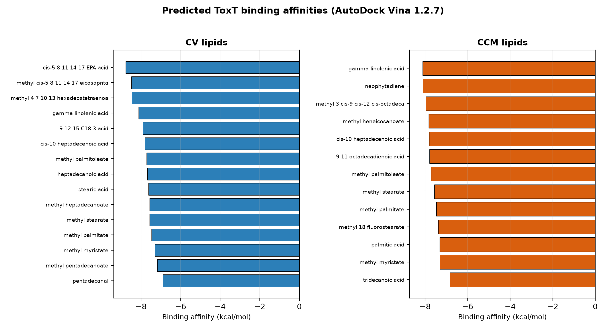

**Figure 1.** Predicted ToxT binding affinities for the CV (blue) and CCM (orange) lipid panels (AutoDock Vina 1.2.7).

### 3.4 Structural determinants of binding
Across all 22 lipids, predicted affinity correlated most strongly with the **number of C=C double bonds** (Pearson r = −0.87) and with **chain length** (carbons, r = −0.70); molecular weight tracked chain length (r = −0.58). Lipophilicity (logP, r = −0.32), polarity (TPSA, r = −0.02), and flexibility (rotatable bonds, r = +0.12) were weak or non-predictive (Table 3).

**Table 3. Descriptor–affinity correlations (n = 22).**

| Descriptor | Pearson r vs. ΔG |
|---|---|
| C=C double bonds | **−0.87** |
| Chain length (C) | −0.70 |
| Molecular weight | −0.58 |
| logP | −0.32 |
| TPSA | −0.02 |
| Rotatable bonds | +0.12 |

The most unsaturated species (EPA, C20:5; hexadecatetraenoate, C16:4; the octadecatrienoates and γ-linolenate, C18:3) were the strongest binders, while fully saturated lipids (tridecanoic, myristate, palmitate) were weakest. The strong-binding outlier neophytadiene (a C20 diterpene, formally 2 C=C) is hydrophobic (logP 7.2) and fits the pocket through shape complementarity rather than a carboxylate interaction.

Two caveats temper this analysis. First, the affinities span only ~2 kcal/mol — comparable to AutoDock Vina's scoring uncertainty — so the correlations describe a **trend across the panel** rather than reliable rank-ordering of individual lipids. Second, the predictive descriptors (unsaturation, chain length, molecular weight, logP) are mutually **collinear**, so their individual contributions cannot be cleanly separated; the correlation with unsaturation should be read as the strongest *marginal* association, not as an isolated causal determinant. The consensus scoring (Section 3.6) and MD (Section 3.8) provide the independent support for these trends.

**Structural basis of the unsaturation preference (same-length C18 series).** To probe *why* unsaturation is favoured while controlling for chain length, a same-length (C18) series was examined — stearic (C18:0), oleic (C18:1), 9,11-octadecadienoic (C18:2), and the two octadecatrienoates (C18:3) (Table 4b, Figure 12). A simple contact count is uninformative and even misleading: because burial scales with chain length, the shorter saturated palmitic acid makes as many aromatic-cage contacts as the longer EPA (94 vs 82 within 4.5 Å). The discriminating feature is instead specific: at fixed C18 length the predicted affinity rises modestly with unsaturation (−7.63 for stearic to −8.13 for γ-linolenic), and **every cis double bond localises within alkene–π contact distance (3.7–4.0 Å) of an aromatic-cage residue** (Tyr12, Tyr20, Tyr266, Phe22, Phe33 or Phe69), whereas saturated stearic engages none (Figure 12). The cis geometry thus appears to favour binding not by increasing overall contact but by positioning the double-bond π-systems against the aromatic cage. This effect is modest (~0.3–0.5 kcal/mol at fixed length, within scoring error) and, being a geometric-proximity argument, does not establish optimal stacking orientation; it is offered as a structural rationale for the panel-level unsaturation trend, not a strong determinant.

**Table 4b. Same-length (C18) series: unsaturation and alkene–π engagement.**

| Lipid | C18:*x* | ΔG (kcal/mol) | C=C in π-contact (<5.5 Å) | closest C=C→ring (Å) |
|---|---|---|---|---|
| stearic | C18:0 | −7.63 | 0/0 | — |
| oleic | C18:1 | −7.90 | 1/1 | 5.2 |
| 9,11-octadecadienoic | C18:2 | −7.80 | 2/2 | 3.8 |
| γ-linolenic | C18:3 | −8.13 | 3/3 | 3.7 |
| α-linolenic | C18:3 | −7.91 | 3/3 | 4.0 |

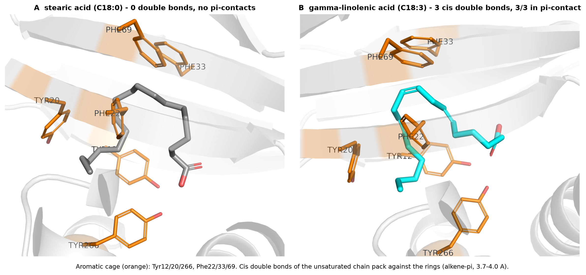

**Figure 12.** Structural basis of the unsaturation preference (same-length C18 comparison). (A) Stearic acid (C18:0) and (B) γ-linolenic acid (C18:3) docked in the ToxT aromatic cage (orange: Tyr12/20/266, Phe22/33/69). The cis double bonds of the unsaturated chain kink the backbone and pack against the aromatic rings (alkene–π, 3.7–4.0 Å; all three double bonds engaged), whereas the saturated chain makes no such π-contacts.

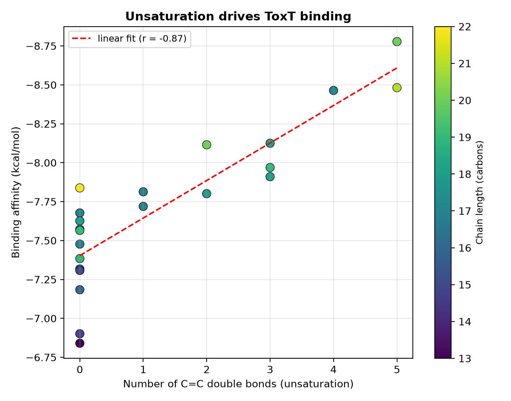

**Figure 2.** Binding affinity vs. number of C=C double bonds (point colour = chain length); dashed line is the linear fit (r = −0.87).

### 3.5 Free-acid vs. methyl-ester form
For every fatty-acid backbone, the free-acid and methyl-ester forms bound with nearly identical affinity (mean |ΔΔG| ≈ 0.11 kcal/mol; maximum 0.42 kcal/mol for ALA), well within Vina's scoring uncertainty (Table 4). ToxT binding is therefore governed by the acyl chain, not the headgroup esterification state, so **both the free acid and the methyl ester are plausible bioactive forms.**

**Table 4. Acid vs. methyl-ester affinity (kcal/mol); Δ = ester − acid (selected backbones).**

| Backbone | C:db | Acid | Ester | Δ |
|---|---|---|---|---|
| EPA | 20:5 | −8.84 | −8.82 | +0.03 |
| hexadecatetraenoate | 16:4 | −8.44 | −8.39 | +0.05 |
| γ-linolenate | 18:3 | −8.24 | −8.35 | −0.11 |
| 9,12,15-octadecatrienoate | 18:3 | −7.89 | −8.31 | −0.42 |
| 9,11-octadecadienoate | 18:2 | −7.91 | −7.89 | +0.01 |
| *cis*-10-heptadecenoate | 17:1 | −7.72 | −7.84 | −0.12 |
| palmitoleate | 16:1 | −7.58 | −7.65 | −0.07 |
| stearate | 18:0 | −7.63 | −7.57 | +0.06 |
| palmitate | 16:0 | −7.29 | −7.41 | −0.12 |
| myristate | 14:0 | −7.14 | −7.31 | −0.17 |
| tridecanoate | 13:0 | −6.82 | −6.85 | −0.03 |

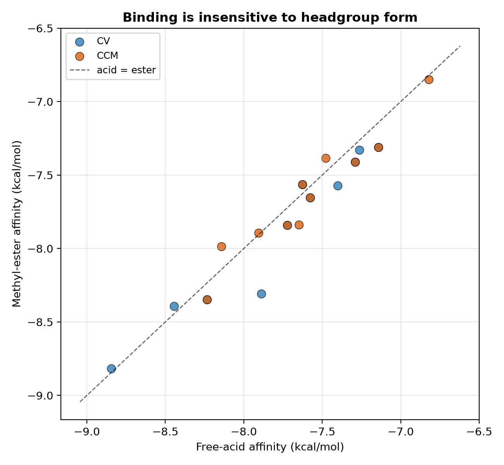

**Figure 4.** Free-acid vs. methyl-ester affinity per backbone; points lie on the y = x line (form-insensitive).

### 3.6 Consensus scoring
Re-docking with the Vinardo scoring function gave rankings strongly concordant with the default Vina scoring (**Spearman ρ = 0.83**, n = 22). The top binders (EPA, methyl-EPA, hexadecatetraenoate, γ-linolenate, neophytadiene, the octadecatrienoates) were top-ranked under both functions. The largest disagreement was the long saturated ester methyl heneicosanoate (Vina −7.84, Vinardo −7.19), which Vinardo penalizes more — consistent with the overall unsaturation trend. The ranking is therefore robust to scoring-function choice and unlikely to reflect scoring artifacts.

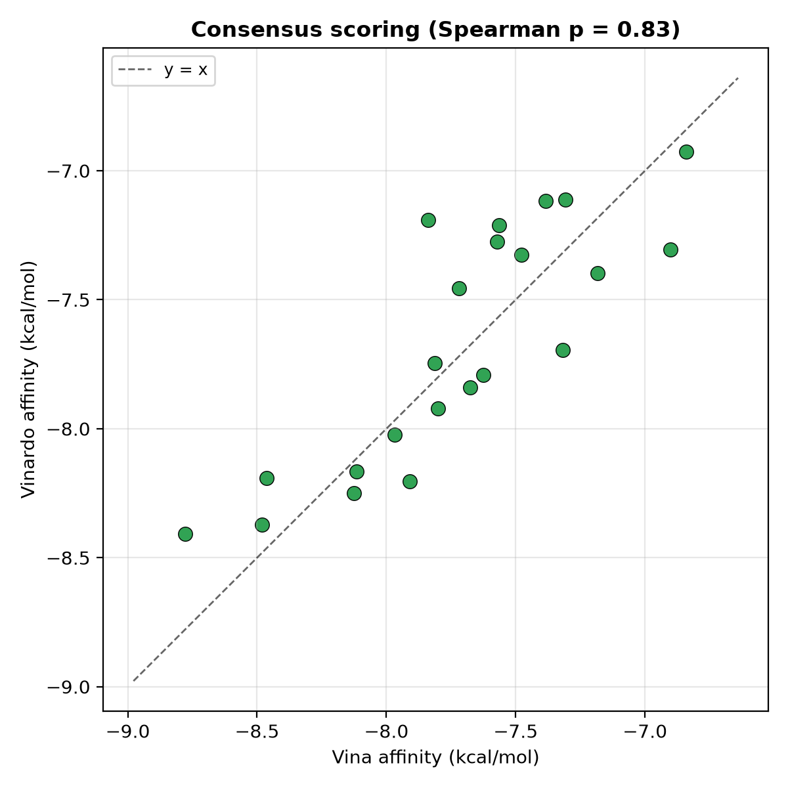

**Figure 3.** Vina vs. Vinardo affinities (n = 22); dashed line is y = x (Spearman ρ = 0.83).

### 3.7 Organism comparison
Mean predicted affinities were nearly identical between organisms (**CV −7.77 vs. CCM −7.64 kcal/mol**; difference 0.13 kcal/mol, within scoring error), and the best single binders were comparable (CV EPA −8.78; CCM γ-linolenate −8.13). Thus, per-molecule ToxT-binding strength does **not** discriminate the two extracts.

### 3.8 Molecular-dynamics validation of the top complex
To test whether the docked poses are dynamically stable, the top binder EPA was simulated in both its free-acid and methyl-ester forms (50 ns each; ~38,800-atom solvated systems). Both complexes were stable: the protein backbone RMSD plateaued rapidly and remained low (1.87 ± 0.27 Å for the acid, 1.66 ± 0.22 Å for the ester), and the radius of gyration was constant, indicating a well-folded receptor throughout (Figure 5, left).

Crucially, the ligand never left the pocket. The ligand centre-of-mass remained 2–4 Å from the pocket centre (minimum-image corrected) for the entire trajectory — **bound in 100% of frames** for both forms (Figure 5, right). Binding was mediated by a persistent residue network (residue numbering follows the deposited crystal structure, PDB 3GBG): for the free acid, Tyr12, Phe22, Leu25, Lys31 and Phe33 (among others) maintained contact in ~100% of production frames (Figure 6); the methyl ester engaged an essentially identical set (Tyr12, Tyr20, Phe22, Leu25, Ile27, Phe33, Val81, Tyr266 all ~100%, with Lys31/Arg13 at the head group). This aromatic cage plus hydrophobic wall, capped by the basic Lys31/Arg13 pair, corresponds to the crystallographic fatty-acid pocket and confirms the docked binding mode is dynamically real.

To test the physiological protonation state, EPA was additionally simulated as its deprotonated carboxylate (the dominant form of a free fatty acid at pH 7.4). This complex was likewise stable (backbone RMSD 1.82 ± 0.12 Å) and, if anything, the most tightly held: the ligand centre of mass stayed 1.1–3.0 Å from the pocket centre (mean 2.1 Å), bound in 100% of frames. Consistent with the added negative charge, the deprotonated head engaged the basic pocket residues more persistently, with Lys31 and Lys230 (and Arg13) in contact ~100% of the time, indicating a salt-bridge-stabilised carboxylate.

To establish that this form-independence is a general property of the pocket rather than a peculiarity of EPA, the analysis was extended to **three fatty acids spanning the affinity range** — EPA (strong, C20:5), γ-linolenic acid (strong, C18:3), and palmitic acid (weak, C16:0) — each simulated in all three chemical forms (free acid, methyl ester, deprotonated carboxylate): **nine 50 ns simulations** (rep-1 trajectory summarised below; all nine were subsequently also run in triplicate as part of the full n = 3 replicate campaign, Section 2.10). Every one produced a stable complex (backbone RMSD 1.5–2.3 Å) with the ligand bound for **100% of the trajectory** in all cases (ligand–pocket distance 1.2–3.4 Å; Table 5, Figure 7).

Thus, across three fatty acids of differing chain length and unsaturation, and across esterification and protonation state, ToxT retains the ligand in the fatty-acid pocket. The binding mode is robust to head-group chemistry; the acyl tail governs occupancy, consistent with the docking structure–property analysis (Section 3.4).

**Table 5. MD summary of the head-group matrix (nine systems, rep-1 trajectory shown; all nine were later also run in triplicate — see Figure 13/14 replicate analyses and Table 9 for the n = 3 MM-GBSA values).**

| Fatty acid | Form | Backbone RMSD (Å) | Ligand–pocket COM (Å) | Bound |
|---|---|---|---|---|
| EPA (C20:5) | free acid | 1.87 ± 0.27 | 2.6 | 100% |
| EPA | methyl ester | 1.66 ± 0.22 | 2.3 | 100% |
| EPA | carboxylate | 1.82 ± 0.12 | 1.7 | 100% |
| γ-linolenic (C18:3) | free acid | 1.91 ± 0.17 | 1.2 | 100% |
| γ-linolenic | methyl ester | 2.12 ± 0.15 | 2.0 | 100% |
| γ-linolenic | carboxylate | 1.65 ± 0.14 | 1.9 | 100% |
| palmitic (C16:0) | free acid | 1.96 ± 0.20 | 3.4 | 100% |
| palmitic | methyl ester | 2.32 ± 0.18 | 3.0 | 100% |
| palmitic | carboxylate | 1.46 ± 0.13 | 2.2 | 100% |

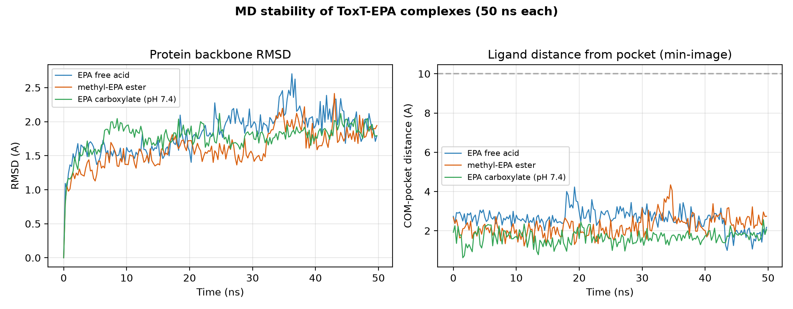

**Figure 5.** MD stability of the ToxT–EPA complexes (three forms, rep-1 trajectory, 50 ns each — each form was later also run in triplicate; see Figure 13 for the free-acid replicate comparison): protein backbone RMSD (left) and ligand centre-of-mass distance from the pocket (right); the 10 Å dashed line marks the bound/unbound threshold.

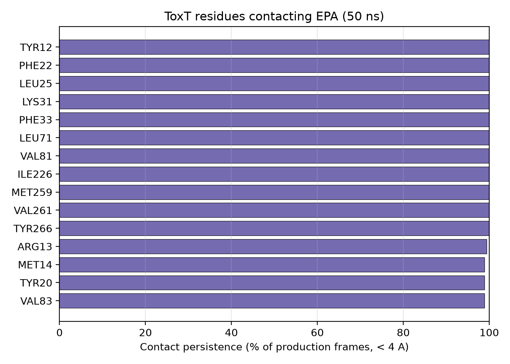

**Figure 6.** ToxT residues contacting EPA and their persistence (% of production frames within 4 Å; rep-1 trajectory).

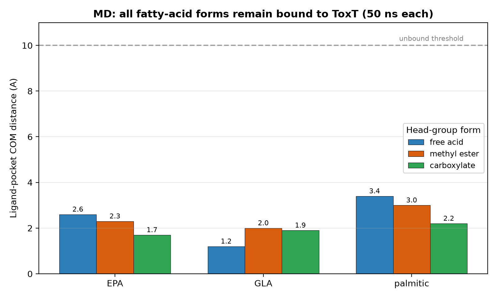

**Figure 7.** Ligand centre-of-mass distance from the pocket (mean over production, rep-1 trajectory) for the nine head-group simulations — three fatty acids (EPA, γ-linolenic, palmitic) × three forms (free acid, methyl ester, carboxylate). All remain far below the 10 Å unbound threshold, i.e. bound throughout.

To test whether ligand occupancy perturbs global backbone dynamics beyond the single-trajectory summary above, protein backbone RMSD was compared — mean ± SD across n = 3 independent-seed replicates — for the three headline fatty acids (free-acid form) against the ligand-free apo simulation, also run in triplicate (Figure 13). All four systems equilibrate to a similar RMSD plateau within the first ~5 ns; from ~20 ns onward the apo replicates drift to a modestly higher plateau (production-window mean 2.12 ± 0.33 Å) than any of the three ligand-bound systems (EPA 1.82 ± 0.22 Å, γ-linolenic 1.83 ± 0.15 Å, palmitic 1.79 ± 0.42 Å), consistent with a modest ligand-stabilising effect on the overall fold. To test this at residue resolution — and to ask specifically whether the distant C-terminal HTH DNA-binding domain (Supplementary Section S.13) is disproportionately rigidified, as an allosteric mechanism would predict — per-residue Cα RMSF was compared between the same apo and headline holo replicates (Figure 14).

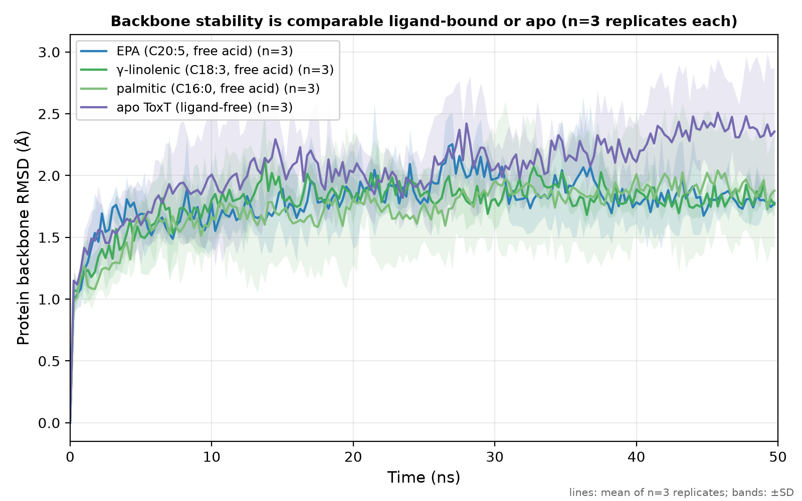

**Figure 13.** Protein backbone RMSD (mean ± SD across n = 3 independent-seed replicates) for the three headline fatty acids in free-acid form (EPA, γ-linolenic, palmitic) versus the ligand-free apo simulation. Apo drifts to a modestly higher RMSD plateau than any ligand-bound system after ~20 ns.

Ligand binding reduced Cα RMSF modestly across the whole protein (apo 1.01 ± 0.19 Å, holo 0.88 ± 0.11 Å; mean over all 260 resolved residues), including at the fatty-acid pocket itself (apo 0.80 Å, holo 0.64 Å) and at five residues identified as DNA-proximal in exploratory ToxT–DNA modelling (Supplementary Section S.13) — Arg214, Lys235, Lys237, Tyr250, Lys256 (apo 0.95 Å, holo 0.77 Å). However, the magnitude of this reduction was similar in the C-terminal HTH domain (residues 188–273; −0.16 Å) and the rest of the N-terminal domain (−0.12 Å) (Figure 14), so the C-terminal domain is not disproportionately rigidified relative to the protein as a whole. This MD evidence indicates a modest, protein-wide stabilisation upon ligand binding, without disproportionate rigidification of any single domain.

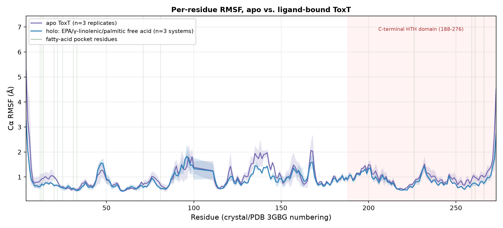

**Figure 14.** Per-residue Cα RMSF (production window, >5 ns) for apo ToxT (n = 3 replicates) versus the three headline free-acid holo systems (EPA, γ-linolenic, palmitic; n = 3 systems, each itself a 3-replicate mean). The C-terminal HTH DNA-binding domain (residues 188–276) is shaded; fatty-acid pocket residues are marked with thin vertical lines. Holo RMSF is modestly lower than apo across most of the sequence, not preferentially within the HTH domain.

### 3.9 Blind docking confirms the fatty-acid pocket as the preferred site
Because the panel was docked into a predefined box, we verified — by blind docking over the entire ToxT surface — that this pocket is genuinely preferred and not merely imposed. The protocol was validated by its recovery of the native ligand: with no pocket bias, palmitoleate's top pose localized **0.6 Å** from its crystallographic position (Table 6). For the strongly-binding polyunsaturated lipids, **every** pose fell in the fatty-acid pocket (EPA 15/15, γ-linolenic 8/8 modes), and no site elsewhere on the protein scored higher. The weak binder palmitic acid also placed its single best pose in the pocket (1.5 Å) but distributed its remaining poses over the surface (1/20 in pocket), consistent with weak, non-specific association. In sharp contrast, the **glucose decoy placed none of its poses in the pocket** (0/20; best pose 17 Å away on the surface, −5.5 kcal/mol), demonstrating that the pocket selects fatty acids over a non-lipid molecule. Thus strong, unsaturated lipids are pocket-selective, saturated lipids bind loosely, and the non-lipid decoy is excluded — mirroring the affinity structure–activity relationship (Section 3.4). No competing high-affinity binding site was detected.

**Table 6. Blind docking (whole-protein search) of representative lipids.**

| Lipid | Top-pose ΔG (kcal/mol) | Top pose → pocket (Å) | Modes in pocket |
|---|---|---|---|
| EPA | −8.48 | 2.9 | 15/15 |
| γ-linolenic acid | −8.30 | 1.2 | 8/8 |
| palmitic acid | −5.72 | 1.5 | 1/20 |
| palmitoleate (native, control) | −7.60 | 0.6 | 10/13 |
| glucose (decoy) | −5.54 | 17.0 | **0/20** |

### 3.10 Structural basis of binding and control simulations
The docked lipids occupy the internal fatty-acid pocket of the ToxT N-terminal domain — an aromatic cage (Tyr12, Tyr20, Phe22, Phe33, Phe69, Tyr266) and hydrophobic wall (Leu/Val/Ile/Met) closed by a basic clamp (Lys31, Lys230, Arg13) that engages the carboxylate head group (Figure 8). Superposition of the full CV and CCM panels shows every lipid converges on this single pocket (Figure 9).

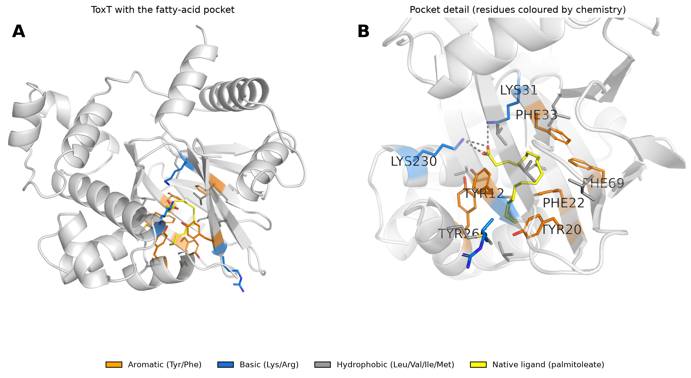

**Figure 8.** ToxT fatty-acid pocket. (A) Whole protein with the pocket highlighted; (B) pocket detail with residues coloured by chemistry (orange aromatic, blue basic, grey hydrophobic) and the native ligand (yellow); dashes mark salt bridges to the carboxylate.

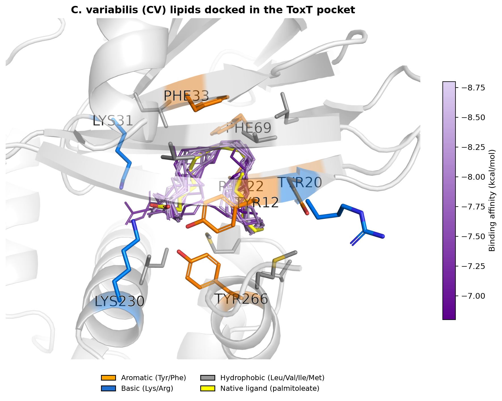
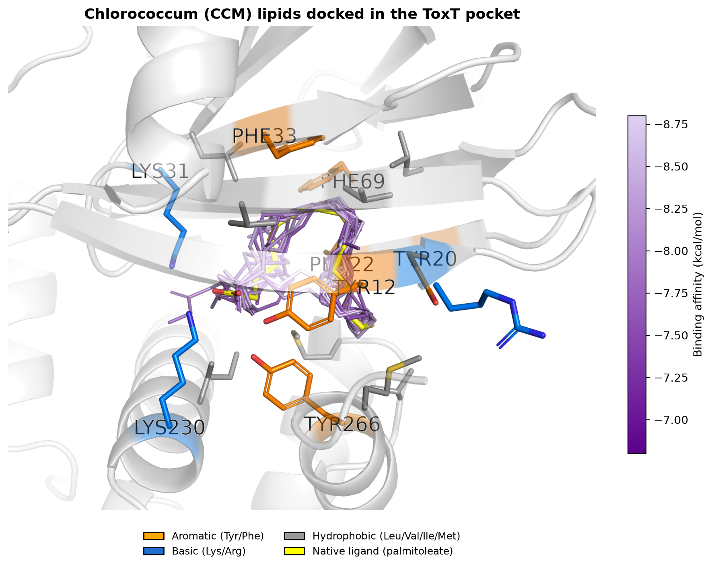

**Figure 9.** All CV (A) and CCM (B) lipids docked in the ToxT pocket, coloured by binding affinity — every species converges on the same site.

Specificity was assessed by both binding preference and dynamics (Table 7). **Positive control:** the native ligand palmitoleate remained bound throughout (ligand–pocket 1.5 Å, 100% of frames), reproducing the crystallographic mode and validating the protocol. **Negative control — binding preference (the primary discriminator):** in blind docking over the entire protein, the glucose decoy **never localised to the fatty-acid pocket** (0 of 20 poses; best pose 17 Å away, on the protein surface) and bound weakly (−5.5 kcal/mol; Table 6), in stark contrast to the fatty acids (8–15 of 15 poses in the pocket at −7 to −8.8 kcal/mol) and consistent with glucose giving the least favourable MM-GBSA energy (Section 3.11). **Negative control — dynamics:** two 50 ns glucose simulations behaved differently according to their starting pose — from its (peripheral) docked pose glucose remained at the pocket mouth (~8.9 Å), whereas when *artificially seeded in the pocket core* it was retained (~2.5 Å) for the entire trajectory (Figure 10). This retention reflects **kinetic trapping in a buried internal cavity**, not favourable binding, and is a general feature of such pockets; it underscores that pocket *preference* (blind docking and energetics), not MD retention, discriminates cognate lipids from the decoy. Consistent with this, the two weakest-docking cognate lipids (pentadecanal, tridecanoic acid) also formed stable complexes once seated (1.7–2.0 Å). An apo (ligand-free) run provided a dynamics baseline.

**Table 7. Control and weak-binder simulations (rep-1 trajectory shown, 50 ns each; palmitoleate, glucose decoy from its docked start, pentadecanal, tridecanoic acid and apo ToxT were later also run in triplicate — see Figure 10/13/14 replicate analyses).**

| System | Role | Ligand–pocket (Å) | Bound |
|---|---|---|---|
| palmitoleate (native) | positive control | 1.5 | 100% |
| glucose — docked (peripheral) start | negative control (decoy) | 8.9 | stays at pocket mouth |
| glucose — seeded in pocket core | negative control (decoy) | 2.5 | retained (buried-cavity trapping, not preference) |
| pentadecanal | weak binder | 1.7 | 100% |
| tridecanoic acid | weak binder | 2.0 | 100% |
| apo ToxT | ligand-free baseline | — | — |

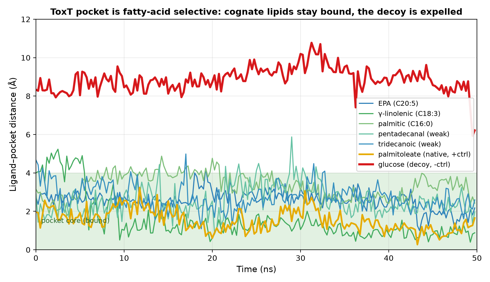

**Figure 10.** Ligand–pocket distance over 50 ns (mean ± SD across n = 3 independent-seed replicates per system; the core-seeded decoy is a single trajectory, n = 1) for the cognate fatty acids, the native ligand, and the glucose decoy from two starting poses. Cognate lipids and the native ligand occupy the pocket core (green band). The decoy from its docked (peripheral) pose stays at the pocket mouth (~9 Å); when *seeded in the core* it is retained (~2.5 Å), reflecting kinetic trapping in a buried cavity rather than binding preference. Specificity is therefore established by binding preference (blind docking, Table 6; MM-GBSA), not by MD retention.

### 3.11 MM-GBSA binding free energies (n = 3 replicates)
To place the docking and MD results on an independent energetic footing, MM-GBSA binding free energies (OBC generalized-Born, entropy omitted; 100 frames/replicate) were computed for every simulated system across all three independent-seed replicates and reported as mean ± SD across the three replicate means (Table 9). EPA is the strongest binder in both its carboxylate (−48.5 ± 3.3 kcal/mol) and free-acid (−42.4 ± 2.6) forms, and both EPA and γ-linolenic acid — in either form — bind more favourably than the native palmitoleate control (−32.5 ± 4.6), consistent with the docking-panel ranking (Section 3.4) and the retention data (Section 3.10). The two weak cognate binders (pentadecanal, tridecanoic acid) and the glucose decoy cluster at the least favourable end, with glucose giving the least favourable energy of all tested ligands, corroborating its exclusion from the pocket in blind docking (Section 3.9).

A single-trajectory (rep 1 only) estimate for the γ-linolenic carboxylate had shown an alarmingly large variance (±20.5 kcal/mol), raising concern that the pose itself might be unstable. Averaging across n = 3 replicates resolves most of this: the SD falls to ±5.9. A dedicated diagnostic (ligand and head-group distance to the pocket centroid, all three replicates; Figure S18) confirms the pose is stable throughout — the ligand centre of mass stays within 0.8–3.5 Å of the pocket in every replicate — while the carboxylate carbon itself remains solvent-exposed at the pocket mouth (~7.2–7.4 Å, SD 0.4–0.6 Å across replicates). The residual single-trajectory variance is therefore a known GB sensitivity to a solvent-exposed anionic head group, not pose instability; we report the neutral free-acid value as the primary γ-linolenic estimate and the carboxylate as a sensitivity check.

**Table 9. MM-GBSA binding free energies per replicate and mean ± SD across replicate means (n = 3, distinct seeds; 100 frames each).**

| Lipid | Form | r1 | r2 | r3 | Mean ± SD (kcal/mol) |
|---|---|---|---|---|---|
| EPA | free acid | −45.1 | −42.1 | −40.0 | −42.4 ± 2.6 |
| EPA | methyl ester | −24.3 | −40.2 | −35.8 | −33.4 ± 8.2 |
| EPA | carboxylate | −49.0 | −45.0 | −51.5 | −48.5 ± 3.3 |
| γ-linolenic (GLA) | free acid | −34.2 | −39.1 | −42.6 | −38.6 ± 4.2 |
| γ-linolenic (GLA) | methyl ester | −31.5 | −37.2 | −23.2 | −30.6 ± 7.0 |
| γ-linolenic (GLA) | carboxylate | −37.6 | −48.4 | −47.0 | −44.3 ± 5.9 |
| palmitic | free acid | −33.2 | −33.3 | −31.5 | −32.7 ± 1.0 |
| palmitic | methyl ester | −36.6 | −36.3 | −37.6 | −36.8 ± 0.7 |
| palmitic | carboxylate | −41.3 | −49.2 | −45.8 | −45.4 ± 4.0 |
| palmitoleate (native) | +control | −33.1 | −36.7 | −27.6 | −32.5 ± 4.6 |
| glucose | decoy | −23.5 | −28.0 | −24.5 | −25.3 ± 2.4 |
| pentadecanal | weak binder | −31.4 | −34.8 | −37.8 | −34.7 ± 3.2 |
| tridecanoic acid | weak binder | −19.8 | −26.6 | −27.4 | −24.6 ± 4.2 |

### 3.12 Comparison with known ToxT ligands
Prior computational studies of ToxT ligands used heterogeneous programs and score units (e.g. GOLD fitness scores; MM interaction energies in kJ/mol) that are not directly comparable across methods. To place the algal lipids on a single, comparable footing, three reference ToxT ligands were docked under the **identical protocol** (same box, seed and Vina 1.2.7 scoring): the engineered inhibitor **virstatin**, the short-chain fatty acid **butyrate** (a recently reported natural ToxT-targeting compound), and **oleic acid** (a native-type unsaturated fatty acid). The algal lipids (−6.8 to −8.8 kcal/mol) bound comparably to the native-type ligand oleic acid (−7.90) and substantially more strongly than butyrate (−3.71). The purpose-designed inhibitor virstatin scored highest (−10.21), as expected for an engineered scaffold — a value that also partly reflects the docking score's known dependence on aromatic surface area, and virstatin's mechanism (interference with ToxT dimerisation) differs from direct pocket occupancy. Thus these microalgae supply **naturally occurring ToxT-pocket binders that engage the site as effectively as its native regulator, without any medicinal-chemistry optimisation** (Table 8).

**Table 8. Reference ToxT ligands docked under the identical protocol.**

| Compound | ΔG (kcal/mol) | Type |
|---|---|---|
| virstatin | −10.21 | synthetic, engineered inhibitor |
| algal lipids (this study) | −6.8 to −8.8 | natural (microalgal) |
| oleic acid | −7.90 | native-type unsaturated fatty acid |
| butyric acid | −3.71 | natural short-chain fatty acid |

An exploratory AlphaFold3 model of ToxT bound to the native El Tor *ctxAB* promoter is presented in the Supplementary Information (Section S.13) as a structural check on the known domain architecture, not as a main-text result.

---

## 4. Discussion

These docking results support direct engagement of algal lipids with the ToxT fatty-acid pocket as a plausible molecular basis for their antivirulence activity. The protocol is validated (native redocking 1.41 Å; blind docking recovers the native site to 0.6 Å), internally consistent across two scoring functions (ρ = 0.83), and yields a clear structure–activity relationship: **binding strength increases with acyl-chain unsaturation and length**, mirroring the native unsaturated ToxT ligand. A same-length (C18) analysis clarifies the structural basis: rather than simply increasing overall contact (which is dominated by chain length), the *cis* double bonds position their π-systems against the aromatic-cage residues (alkene–π, 3.7–4.0 Å; Section 3.4, Figure 12), providing a specific — if modest — rationale for the unsaturation preference. Molecular dynamics and a full control set place this on a firmer footing: the pocket is fatty-acid **selective** — in blind docking the decoy never selects the pocket (0/20) and binds weakly, while the fatty acids strongly prefer it — and all cognate lipids form stable complexes across chain length, unsaturation, esterification and protonation state. We note explicitly that, because the pocket is a buried internal cavity, MD retention alone does not distinguish binders from non-binders (a core-seeded glucose decoy is also retained); the specificity conclusion therefore rests on binding preference and energetics rather than on MD stability. The fatty-acid pocket and the DNA-binding HTH domain occupy separate domains of ToxT (Lowden et al., 2010), consistent with the pocket acting on the protein's regulatory conformation rather than through direct steric competition with DNA. We present an exploratory structural check on this domain architecture — an AlphaFold3 model of ToxT bound to the native El Tor *ctxAB* promoter — in the Supplementary Information (Section S.13), but do not treat it as establishing a binding geometry or mechanism for these lipids.

Critically, this closes the loop with our experimental observations (Jaiswal et al., 2025). ToxT is the direct transcriptional activator of the *ctxAB* (cholera-toxin) promoter; lipid occupancy of the ToxT pocket therefore offers a concrete molecular explanation for the 93–97.9% suppression of CT production — with viability intact — that we measured for CV and CCM extracts in vitro and in the rabbit ileal-loop model. Moreover, the greater in-vitro potency of CCM (97.9% CT inhibition) relative to CV, despite statistically indistinguishable per-lipid docking affinities, is consistent with our interpretation that organism-level differences arise from extract composition and abundance rather than from intrinsically stronger individual binders. The computational study thus supplies the missing mechanistic layer — a specific, druggable target and binding mode — beneath a previously phenomenological antivirulence observation.

The headgroup-independence (acid ≈ ester, confirmed by MD) indicates that the carboxylate is not the dominant anchor; the hydrophobic tail and its unsaturation dictate pocket fit. This means GC-MS uncertainty about the bioactive form does not undermine the proposed mechanism — both forms bind and are stable.

Notably, docking does **not** reproduce the experimental observation that CCM is the more active extract: per-lipid affinities are statistically indistinguishable between CV and CCM. This is expected and informative. Docking ranks single molecules at equal concentration, whereas in vivo activity reflects the **abundance-weighted composition** of a complex mixture, plus solubility, membrane permeability, metabolic stability, and possible multi-target or synergistic effects — none captured by single-ligand docking. The most likely explanation is that CCM is enriched in **abundant** strong binders. This is directly testable by combining these affinities with GC-MS relative abundances into an abundance-weighted binding score (future work).

From a translational standpoint, the distinguishing feature of these lipids is not that they are the strongest conceivable ToxT binders — the engineered inhibitor virstatin scores higher — but that they are **naturally produced, renewable compounds** that engage the validated regulatory pocket as effectively as ToxT's native fatty-acid ligand, and do so with **no synthesis or medicinal-chemistry optimisation**. Combined with the antivirulence activity we previously reported for these microalgal extracts, this positions *Chlorella variabilis* and *Chlorococcum* sp. lipids as a natural, cultivable source of ToxT-pocket-directed antivirulence leads.

## 5. Limitations

This study is entirely computational and is intended to provide a mechanistic rationale for the antivirulence activity we reported experimentally elsewhere; it does not itself demonstrate ToxT inhibition, which will require direct assays (e.g. ToxT–DNA EMSA or a virulence-promoter reporter).

- **Scoring uncertainty.** The panel affinities span only ~2 kcal/mol, within Vina's error; correlations (e.g. unsaturation, r = −0.87) describe panel-level trends, not reliable per-lipid ranking, and the predictive descriptors are collinear.
- **Single receptor conformation; finite sampling per replicate.** Docking used one rigid crystal conformation. Each MD system was run as n = 3 independent-seed 50 ns replicates (42 trajectories across 14 systems; Section 2.10), which is sufficient to distinguish genuine between-run variance from single-trajectory noise (Section 3.11) but does not extend the sampled timescale: because the fatty-acid pocket is internal, ligand retention is still a modest bar and not by itself strong evidence of favourable binding, and 50 ns per replicate remains short relative to slower conformational processes (e.g. induced fit, full head-group reorientation). Longer per-replicate sampling would further strengthen this; the specificity argument therefore continues to rest on binding preference (blind docking and energetics), not on MD retention (see decoy control below).
- **Decoy control and buried-pocket caveat.** The glucose decoy was tested from both a peripheral docked pose and seeded in the pocket core; because it is retained when core-seeded, MD stability does not by itself establish specificity for this internal pocket. The specificity conclusion therefore rests on binding preference (blind docking: 0/20 poses in the pocket; weak affinity) and energetics (MM-GBSA), which we consider the appropriate discriminators. An apo-versus-holo per-residue RMSF comparison (Section 3.8, Figure 14) found a modest, protein-wide stabilisation upon ligand binding (Cα RMSF −0.13 Å on average) but no disproportionate rigidification of the C-terminal HTH domain specifically (−0.16 Å there vs. −0.12 Å in the rest of the protein).
- **MM-GBSA.** MM-GBSA (OBC, entropy omitted) yields relative, not absolute, energies. Values are reported as mean ± SD across n = 3 independent-seed replicates per system (Table 9); replicate averaging substantially reduced the large single-trajectory variance seen for charged and some ester ligands (e.g. the γ-linolenic carboxylate fell from ±20.5 to ±5.9 kcal/mol on averaging), though esterified forms such as the EPA methyl ester (±8.2) still show comparatively larger between-replicate spread and should be read with correspondingly wider uncertainty.
- **ToxT–DNA structural check (Supplementary Information).** Reported only in the SI (Section S.13), not the main text: an AlphaFold3 model of ToxT bound to the native El Tor *ctxAB* promoter places all 26 DNA-contacting residues in the C-terminal domain, none in the N-terminal fatty-acid pocket, but the interface confidence is modest (ipTM 0.48, below a confident threshold) and the duplex is modelled as an isolated 36-bp fragment without flanking genomic context, RNA polymerase or H-NS. This is an exploratory check on the known domain-separated architecture (Lowden et al., 2010), not an independently established binding geometry or mechanism for these lipids.
- **Organism-level interpretation** requires quantitative GC-MS abundances, available here only qualitatively; abundance-weighting remains future work.

## 6. Reproducibility and data availability

All steps are deterministic (fixed seed = 42). Residue numbering follows PDB 3GBG; shared MD topologies were renumbered to match. Code, inputs and small outputs are on GitHub (https://github.com/MrsSwetaJaiswal/ToxT-algal-lipid-docking, v1.0.0), archived on Zenodo, DOI: [10.5281/zenodo.21778158](https://doi.org/10.5281/zenodo.21778158); full molecular-dynamics trajectories, serialized systems and simulation topologies are archived separately on Zenodo, DOI: [10.5281/zenodo.21767402](https://doi.org/10.5281/zenodo.21767402) (see `DATA_AVAILABILITY.md`). Key scripts:
- **Receptor/box:** Meeko `mk_prepare_receptor` (box enveloping the crystal PAM, 5 Å padding).
- **Ligand generation:** `generate_missing_3d.py` (RDKit ETKDG/MMFF from SMILES).
- **Docking:** `dock_by_organism.py`; **validation:** `pam_control.py`; **blind:** `blind_dock.py`.
- **Both forms:** `pairs_pipeline.py`; **consensus:** `consensus_scoring.py`; **structure–property:** `structural_analysis.py`.
- **MD:** `md_production.py` / `md_production_apo.py` / `md_supervisor.py`; **analysis/figures:** `md_summary.py`, `md_figures.py`, `make_specificity_fig.py`, `render_docking4.py`.

## References (to be formatted to journal style)

*ToxT biology, structure and inhibitors*
1. Lowden MJ, et al. Structure of *Vibrio cholerae* ToxT reveals a mechanism for fatty acid regulation of virulence genes. *PNAS* 2010;107:2860–2865.
2. Withey JH, DiRita VJ. The toxbox: specific DNA sequence requirements for activation of *Vibrio cholerae* virulence genes by ToxT. *Mol Microbiol* 2006;59:1779–1789.
3. Hung DT, et al. Small-molecule inhibitor of *Vibrio cholerae* virulence and intestinal colonization (virstatin). *Science* 2005;310:670–674.
4. Woodbrey AK, et al. A modified ToxT inhibitor reduces *Vibrio cholerae* virulence in vivo. *Biochemistry* 2018;57:5609–5615.
5. Anthouard R, DiRita VJ. Small-molecule inhibitors of toxT expression in *Vibrio cholerae* (toxtazins). *mBio* 2013;4:e00403-13.
6. Woodbrey AK, Onyango EO, Pellegrini M, Kovacikova G, Taylor RK, Gribble GW, Kull FJ. A new class of inhibitors of the AraC family virulence regulator *Vibrio cholerae* ToxT. *Sci Rep* 2017;7:45011. doi:10.1038/srep45011.
7. Canals A, Pieretti S, Muriel-Masanes M, El Yaman N, Plecha SC, Thomson JJ, Fàbrega-Ferrer M, Pérez-Luque R, Krukonis ES, Coll M. ToxR activates the *Vibrio cholerae* virulence genes by tethering DNA to the membrane through versatile binding to multiple sites. *Proc Natl Acad Sci USA* 2023;120:e2304378120. PDB 8B4D. doi:10.1073/pnas.2304378120.
8. Perveen S, Chaudhary HS. In silico screening of antibacterial compounds from herbal sources against *Vibrio cholerae*. *Pharmacogn Mag* 2015;11(Suppl 4):S550–S555. doi:10.4103/0973-1296.172960.
9. Kundu S, Das S, Maitra P, Halder P, Koley H, Mukhopadhyay AK, Miyoshi S, Dutta S, Chatterjee NS, Bhattacharya S. Sodium butyrate inhibits the expression of virulence factors in *Vibrio cholerae* by targeting ToxT protein. *mSphere* 2025;10(5):e00824-24. doi:10.1128/msphere.00824-24.
10. Jaiswal S, Vadadoriya N, Nasir A, Dineshkumar R, Khatri N, Raut S, Ray Chaudhuri S, Chatterjee S, Haldar S. Exploring microalgal lipids as anti-virulent agents targeting MDR *Vibrio cholerae* infection: a step toward developing herbal oral rehydration salt (ORS) formulations. *J Nat Prod Discov* 2025;4(2):3244. doi:10.24377/jnpd.article3244. *(our prior experimental study; GC-MS profiles = its Table 2)*
11. Kumaran M, Palanisamy KM, Bhuyar P, Maniam GP, Rahim MHA, Govindan N. Agriculture of microalgae *Chlorella vulgaris* for polyunsaturated fatty acids (PUFAs) production employing palm oil mill effluents (POME) for future food, wastewater, and energy nexus. *Energy Nexus* 2023;9:100169. doi:10.1016/j.nexus.2022.100169.

*Computational methods and tools*
12. Trott O, Olson AJ. AutoDock Vina. *J Comput Chem* 2010;31:455–461.
13. Eberhardt J, Santos-Martins D, Tillack AF, Forli S. AutoDock Vina 1.2.0. *J Chem Inf Model* 2021;61:3891–3898.
14. Quiroga R, Villarreal MA. Vinardo scoring function. *PLoS ONE* 2016;11:e0155183.
15. Eastman P, et al. OpenMM 8: Molecular dynamics simulation with machine-learning potentials. *J Phys Chem B* 2024;128:109–116.
16. Boothroyd S, et al. Development and benchmarking of Open Force Field 2.0.0 (Sage). *J Chem Theory Comput* 2023;19:3251–3275.
17. Open Force Field Initiative. OpenFF NAGL: graph neural network partial charge assignment. https://github.com/openforcefield/openff-nagl *(software; no dedicated peer-reviewed publication identified as of this draft — verify before submission and cite the specific pinned version/release used, per Methods 2.10.)*
18. Abramson J, et al. Accurate structure prediction of biomolecular interactions with AlphaFold3. *Nature* 2024;630:493–500.
19. McGibbon RT, et al. MDTraj: A modern open library for the analysis of molecular dynamics trajectories. *Biophys J* 2015;109:1528–1532.
20. Kim S, et al. PubChem 2023 update. *Nucleic Acids Res* 2023;51:D1373–D1380.
21. Landrum G, et al. RDKit: Open-source cheminformatics. https://www.rdkit.org.

*(2026-08-03: all previously-bracketed placeholder references (6–9, 16 at the time) have been resolved via web search and filled in with full citations. Two needed a year correction from the original placeholder guess: the herbal-screen reference is 2015, not 2016 (Pharmacogn Mag, Suppl 4); the sodium-butyrate reference is 2025, not 2024 (mSphere; received Oct 2024, published May 2025) — cite by actual publication year. Ref 17 (OpenFF-NAGL) is a software-only citation; no peer-reviewed paper was found, so verify this is still accurate before submission.)*

*(2026-08-25: author-supplied strain designations and GC-MS methodology added (Section 2.1) — CV accession (ATCC PTA-12198) and the full GC-MS protocol are now in the manuscript. CCM confirmed by the authors to have no culture-collection accession number (not a missing placeholder — genuinely none available for this isolate). The apparent* cis*-10-heptadecenoic acid organism-assignment inconsistency flagged the same day was confirmed by the authors to be an error in the original Jaiswal et al. (2025) report; the compound is shared between CV and CCM, consistent with how Tables 1/2 of this manuscript already had it.)*

*(2026-08-26: full citation for ref 11 (Kumaran et al., 2023) supplied by the authors and filled into the reference list — Kumaran M, Palanisamy KM, Bhuyar P, Maniam GP, Rahim MHA, Govindan N., *Energy Nexus* 2023;9:100169, doi:10.1016/j.nexus.2022.100169. No open reference or author-supplied-content items remain in this manuscript.)*
