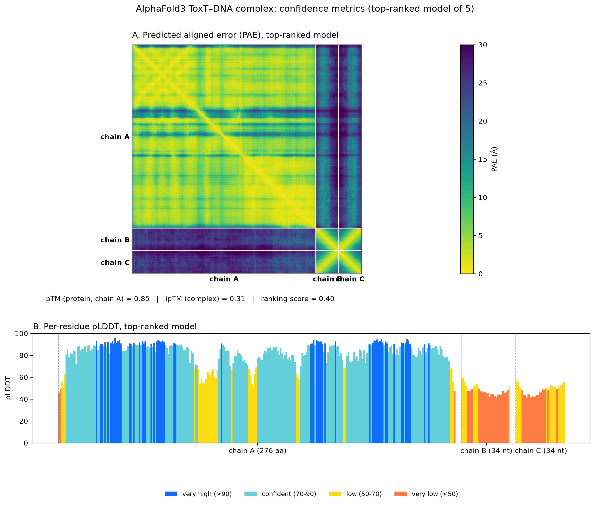
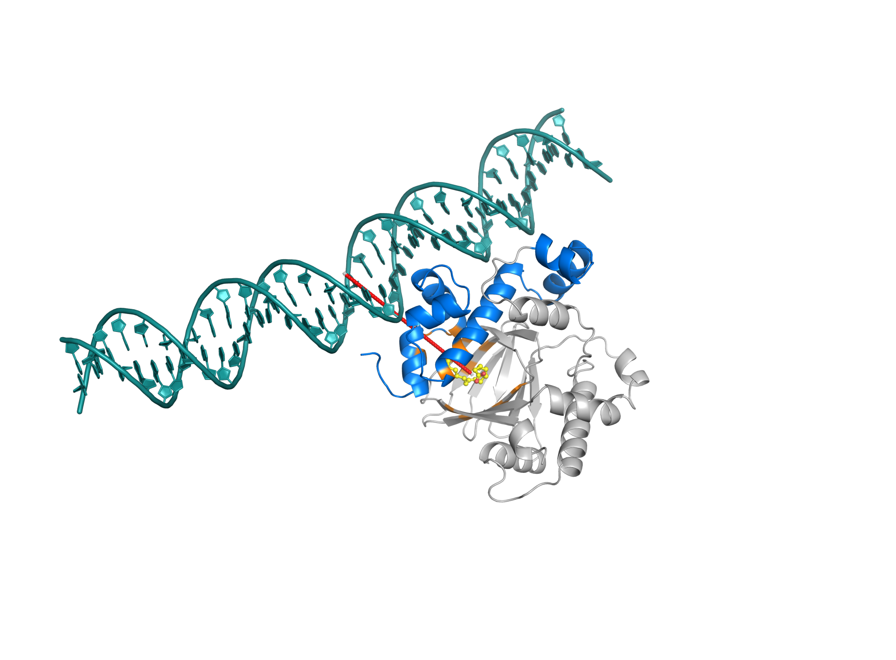

# Supplementary Information

**Unsaturation Drives ToxT Fatty-Acid-Pocket Engagement: Microalgal Lipids as
Antivirulence Agents Against *Vibrio cholerae* — A Docking and Molecular
Dynamics Study**

*Draft — supplementary figures and tables supporting the main manuscript
(`MANUSCRIPT_DRAFT.md`). Figures are numbered S1–S24 and tables S1–S10, in the
order they appear below; the single in-text SI citation in the main manuscript
(Section 3.11, MM-GBSA) now points to Figure S18 by number. Section S.13
(Figure S23) is a full section moved here from the main manuscript's former
Section 3.13 — see its note for why. Section S.14 (Figure S24, Table S10) is
a new supplementary-only analysis (not in the main manuscript at all) run to
directly test the allosteric-restraint hypothesis on the existing MD
trajectories; it is a null result — see its note for interpretation.*

---

## Contents

**Figures:**
[S1](#figure-s1-individual-docking-poses--cv-panel-15-lipids) (CV docking poses) ·
[S2](#figure-s2-individual-docking-poses--ccm-panel-13-lipids) (CCM docking poses) ·
[S3–S17](#figures-s3s17--table-s1-individual-md-trajectory-diagnostics-per-system-all-3-replicates) (per-system MD diagnostics, r1–r3) ·
[S18–S19](#figures-s18s19-gla-carboxylate-gb-variance-diagnostic) (GLA carboxylate GB-variance diagnostic) ·
[S20](#figure-s20-blind-docking-pose-galleries-whole-protein-search) (blind-docking pose galleries) ·
[S21](#figure-s21-individual-vinardo-scored-docking-poses-22-lipids) (Vinardo pose gallery) ·
[S22](#figure-s22-alphafold3-toxt-dna-complex-confidence-metrics) (AlphaFold3 PAE/pLDDT) ·
[S23](#section-s13--figure-s23-a-modelled-toxtdna-complex-presented-as-an-exploratory-structural-check) (ToxT–DNA model, moved from main text) ·
[S24](#section-s14--figure-s24--table-s10-inter-domain-hinge-angle-analysis-a-direct-null-test-of-the-allosteric-restraint-hypothesis) (inter-domain hinge angle, null result)

**Tables:**
[S1](#table-s1-summary-mean--sd-across-n3-replicates-this-si-pipeline) (replicate MD summary, mean ± SD) ·
[S2–S9](#tables-s2s9-supplementary-data-tables) (full docking/MM-GBSA result CSVs) ·
[S10](#section-s14--figure-s24--table-s10-inter-domain-hinge-angle-analysis-a-direct-null-test-of-the-allosteric-restraint-hypothesis) (inter-domain hinge-angle summary)

**Other:** [Remaining open items](#remaining-open-items)

## SI figure/table index

| # | Item | Cited in main text as... |
|---|---|---|
| Figure S1 | CV panel individual docking poses (15) | supports Table 1, Figure 9A |
| Figure S2 | CCM panel individual docking poses (13) | supports Table 2, Figure 9B |
| Figure S3 | EPA free acid — MD diagnostics, r1–r3 | supports Table 5, Figures 5–7 |
| Figure S4 | EPA deprotonated carboxylate — MD diagnostics, r1–r3 | supports Table 5, Figures 5–7 |
| Figure S5 | EPA methyl ester — MD diagnostics, r1–r3 | supports Table 5, Figures 5–7 |
| Figure S6 | GLA free acid — MD diagnostics, r1–r3 | supports Table 5, Figures 5–7 |
| Figure S7 | GLA deprotonated carboxylate — MD diagnostics, r1–r3 | supports Table 5, Figures 5–7 |
| Figure S8 | GLA methyl ester — MD diagnostics, r1–r3 | supports Table 5, Figures 5–7 |
| Figure S9 | Palmitic free acid — MD diagnostics, r1–r3 | supports Table 5, Figures 5–7 |
| Figure S10 | Palmitic deprotonated carboxylate — MD diagnostics, r1–r3 | supports Table 5, Figures 5–7 |
| Figure S11 | Palmitic methyl ester — MD diagnostics, r1–r3 | supports Table 5, Figures 5–7 |
| Figure S12 | Palmitoleate (native ligand) — MD diagnostics, r1–r3 | supports Table 7 |
| Figure S13 | Glucose decoy (docked start) — MD diagnostics, r1–r3 | supports Table 7, Figure 10 |
| Figure S14 | Pentadecanal — MD diagnostics, r1–r3 | supports Table 7 |
| Figure S15 | Tridecanoic acid — MD diagnostics, r1–r3 | supports Table 7 |
| Figure S16 | Apo ToxT — MD diagnostics, r1–r3 | supports Figures 13, 14 |
| Figure S17 | Glucose decoy, core-seeded (single trajectory) — MD diagnostics | supports Table 7, Figure 10 |
| Figure S18 | GLA carboxylate GB-variance diagnostic, r1–r3 | **cited in-text**, Section 3.11 ("(Figure S18)") |
| Figure S19 | GLA free-acid replicate check | related to Figure S18, not separately cited |
| Figure S20 | Blind-docking pose galleries, all modes, 5 ligands | supports Table 6, Section 3.9 |
| Figure S21 | Individual Vinardo-scored docking poses (22 lipids) | supports Figure 3, Section 3.6 |
| Figure S22 | AlphaFold3 PAE/pLDDT confidence metrics | supports Figure S23, Section S.13 |
| Figure S23 | AlphaFold3 model of the ToxT–DNA complex (moved from main text) | formerly main-text Figure 11 / Section 3.13; cited from main-text Sections 3.8, 4, 5 |
| Figure S24 | Inter-domain hinge-angle distributions, apo vs. holo (null result) | supplementary-only analysis, not cited in main text |
| Table S1 | Per-system MD replicate summary, mean ± SD (this SI pipeline) | independent cross-check on Figure 13 |
| Table S2 | Full CV panel docking affinities (15) | source for Table 1 |
| Table S3 | Full CCM panel docking affinities (13) | source for Table 2 |
| Table S4 | Blind-docking summary, all poses per ligand | source for Table 6 |
| Table S5 | Vina vs. Vinardo affinity, all 22 ligands | source for Figure 3, Section 3.6 |
| Table S6 | Reference ligand docking (virstatin/butyrate/oleic acid) | source for Table 8 |
| Table S7 | Acid vs. methyl-ester paired affinities, both organisms | source for Table 4 |
| Table S8 | Full descriptor set, all 22 ligands | source for Table 3 |
| Table S9 | Per-replicate MM-GBSA raw values, all 13 systems | source for Table 9 |
| Table S10 | Inter-domain hinge-angle summary, apo vs. 3 holo systems (n=3 replicates each) | source for Figure S24 / Section S.14 |

---

## Figure S1. Individual docking poses — CV panel (15 lipids)

Each panel shows the individual top-ranked AutoDock Vina pose (cyan) superposed
on the ToxT fatty-acid pocket, with the co-crystallized native ligand
palmitoleate (yellow, PDB 3GBG) and pocket residues coloured by chemistry
(orange = aromatic, blue = basic, grey = hydrophobic). Complements the panel
overlay in main-text Figure 9A, at per-ligand resolution. Ranked by affinity
(matches Table 1).

| Rank | Lipid | ΔG (kcal/mol) | Image |
|---|---|---|---|
| 1 | EPA (eicosapentaenoic acid) | −8.78 | `figures/si_docking/CV_cis_5_8_11_14_17_eicosapentaenoic_acid.png` |
| 2 | methyl eicosapentaenoate | −8.48 | `figures/si_docking/CV_methyl_cis_5_8_11_14_17_eicosapntaenoate.png` |
| 3 | methyl 4,7,10,13-hexadecatetraenoate | −8.46 | `figures/si_docking/CV_methyl_4_7_10_13_hexadecatetraenoate.png` |
| 4 | γ-linolenic acid | −8.13 | `figures/si_docking/CV_gamma_linolenic_acid.png` |
| 5 | 9,12,15-octadecatrienoic acid (ALA) | −7.91 | `figures/si_docking/CV_9_12_15_octadecatrienoic_acid.png` |
| 6 | *cis*-10-heptadecenoic acid | −7.81 | `figures/si_docking/CV_cis_10_heptadecenoic_acid.png` |
| 7 | methyl palmitoleate | −7.72 | `figures/si_docking/CV_methyl_palmitoleate.png` |
| 8 | heptadecanoic acid | −7.68 | `figures/si_docking/CV_heptadecanoic_acid.png` |
| 9 | stearic acid | −7.63 | `figures/si_docking/CV_stearic_acid.png` |
| 10 | methyl heptadecanoate | −7.57 | `figures/si_docking/CV_methyl_heptadecanoate.png` |
| 11 | methyl stearate | −7.57 | `figures/si_docking/CV_methyl_stearate.png` |
| 12 | methyl palmitate | −7.48 | `figures/si_docking/CV_methyl_palmitate.png` |
| 13 | methyl myristate | −7.31 | `figures/si_docking/CV_methyl_myristate.png` |
| 14 | methyl pentadecanoate | −7.18 | `figures/si_docking/CV_methyl_pentadecanoate.png` |
| 15 | pentadecanal | −6.90 | `figures/si_docking/CV_pentadecanal.png` |

**Rank 1: EPA (eicosapentaenoic acid) (−8.78 kcal/mol)**

**Rank 2: methyl eicosapentaenoate (−8.48 kcal/mol)**

**Rank 3: methyl 4,7,10,13-hexadecatetraenoate (−8.46 kcal/mol)**

**Rank 4: γ-linolenic acid (−8.13 kcal/mol)**

**Rank 5: 9,12,15-octadecatrienoic acid (ALA) (−7.91 kcal/mol)**

**Rank 6: *cis*-10-heptadecenoic acid (−7.81 kcal/mol)**

**Rank 7: methyl palmitoleate (−7.72 kcal/mol)**

**Rank 8: heptadecanoic acid (−7.68 kcal/mol)**

**Rank 9: stearic acid (−7.63 kcal/mol)**

**Rank 10: methyl heptadecanoate (−7.57 kcal/mol)**

**Rank 11: methyl stearate (−7.57 kcal/mol)**

**Rank 12: methyl palmitate (−7.48 kcal/mol)**

**Rank 13: methyl myristate (−7.31 kcal/mol)**

**Rank 14: methyl pentadecanoate (−7.18 kcal/mol)**

**Rank 15: pentadecanal (−6.90 kcal/mol)**

---

## Figure S2. Individual docking poses — CCM panel (13 lipids)

Same rendering convention as Figure S1. Complements main-text Figure 9B
(matches Table 2).

| Rank | Lipid | ΔG (kcal/mol) | Image |
|---|---|---|---|
| 1 | γ-linolenic acid | −8.13 | `figures/si_docking/CCM_gamma_linolenic_acid.png` |
| 2 | neophytadiene | −8.12 | `figures/si_docking/CCM_neophytadiene.png` |
| 3 | methyl 3,9,12-octadecatrienoate | −7.97 | `figures/si_docking/CCM_methyl_3_cis_9_cis_12_cis_octadecatrienoate.png` |
| 4 | methyl heneicosanoate | −7.84 | `figures/si_docking/CCM_methyl_heneicosanoate.png` |
| 5 | *cis*-10-heptadecenoic acid | −7.81 | `figures/si_docking/CCM_cis_10_heptadecenoic_acid.png` |
| 6 | 9,11-octadecadienoic acid | −7.80 | `figures/si_docking/CCM_9_11_ooctadecadienoic_acid.png` |
| 7 | methyl palmitoleate | −7.72 | `figures/si_docking/CCM_methyl_palmitoleate.png` |
| 8 | methyl stearate | −7.57 | `figures/si_docking/CCM_methyl_stearate.png` |
| 9 | methyl palmitate | −7.48 | `figures/si_docking/CCM_methyl_palmitate.png` |
| 10 | methyl 18-fluorostearate | −7.38 | `figures/si_docking/CCM_methyl_18_fluorostearate.png` |
| 11 | palmitic acid | −7.32 | `figures/si_docking/CCM_palmitic_acid.png` |
| 12 | methyl myristate | −7.31 | `figures/si_docking/CCM_methyl_myristate.png` |
| 13 | tridecanoic acid | −6.84 | `figures/si_docking/CCM_tridecanoic_acid.png` |

**Rank 1: γ-linolenic acid (−8.13 kcal/mol)**

**Rank 2: neophytadiene (−8.12 kcal/mol)**

**Rank 3: methyl 3,9,12-octadecatrienoate (−7.97 kcal/mol)**

**Rank 4: methyl heneicosanoate (−7.84 kcal/mol)**

**Rank 5: *cis*-10-heptadecenoic acid (−7.81 kcal/mol)**

**Rank 6: 9,11-octadecadienoic acid (−7.80 kcal/mol)**

**Rank 7: methyl palmitoleate (−7.72 kcal/mol)**

**Rank 8: methyl stearate (−7.57 kcal/mol)**

**Rank 9: methyl palmitate (−7.48 kcal/mol)**

**Rank 10: methyl 18-fluorostearate (−7.38 kcal/mol)**

**Rank 11: palmitic acid (−7.32 kcal/mol)**

**Rank 12: methyl myristate (−7.31 kcal/mol)**

**Rank 13: tridecanoic acid (−6.84 kcal/mol)**

*(Note: 6 lipids are shared between the CV and CCM panels — γ-linolenic acid,
*cis*-10-heptadecenoic acid, methyl palmitoleate, methyl stearate, methyl
palmitate, methyl myristate. Each was docked independently per organism run
[README: "CV and CCM panels were docked as two independent runs into the same
pocket"], so both individual poses/images are shown above, one per organism.)*

---

## Figures S3–S17 & Table S1. Individual MD Trajectory Diagnostics, Per System (All 3 Replicates)

For every one of the 14 simulated systems, three per-run diagnostic panels are
available per replicate (produced by `md_analyze.py`, analysis conda env):
**(A)** protein backbone + ligand RMSD vs. time, **(B)** per-residue Cα RMSF
(production window, >5 ns), **(C)** ligand-contact persistence (% of production
frames within 4 Å, top 15 residues; apo has no ligand, so no contacts panel).
These are the per-replicate diagnostics underlying the main-text summary figures
(Table 5, Table 7, Figure 5, Figure 6, Figure 7).

> **Note on a fix applied while generating this SI set:** the original
> `md_analyze.py` had two bugs that would have produced misleading
> supplementary figures: (1) mdtraj's `"protein"` atom selector treats residue
> name `UNK` as a protein placeholder, so the ligand (also named `UNK` by
> OpenFF) was leaking into the protein-residue contact list, producing a
> spurious 100%-persistence "UNK1" self-contact bar on every contacts plot;
> (2) the ligand RMSD trace had no periodic-boundary unwrapping, so a ligand
> that crossed the box edge showed a spurious multi-Å "jump" that read as
> unbinding when it wasn't (confirmed on `gla_deprot_50ns`: apparent ligand
> RMSD 20.2 ± 29.5 Å and a false "drifted" flag before the fix, vs. 3.7 ± 0.6 Å
> and "bound" after — consistent with the independently-diagnosed COM-distance
> result in Figure S18). Both are fixed in the current `md_analyze.py`; all 43
> per-run figure sets (14 systems × 3 replicates, minus apo's contacts panel)
> were regenerated with the fix. This does **not** change any main-text
> number — the headline RMSD/MM-GBSA/contact values reported in the manuscript
> were computed by separate, already-PBC-corrected pipelines
> (`md_summary.py`, `md_contacts_pbc.py`, `md_mmgbsa*.py`, `md_figures.py`
> — the last of which built the actual main-text Figures 5/6 and already had
> both corrections from the start); it only affects the per-run SI diagnostic
> plots generated here.

### Table S1. Summary: mean +/- SD across n=3 replicates (this SI pipeline)

Protein backbone RMSD and ligand RMSD (PBC-corrected, production window >5 ns),
computed independently by `md_analyze.py` per replicate, then averaged as
**mean +/- SD across the 3 replicate means** (matching the manuscript's replicate-
statistics convention, Section 2.9). Protein-backbone values are an independent
cross-check on the main-text headline systems (Figure 13) and agree closely
(e.g. apo 2.12 +/- 0.15 A here vs. 2.12 +/- 0.33 A in Figure 13; EPA free acid
1.83 +/- 0.09 A here vs. 1.82 +/- 0.22 A there). **Ligand RMSD is a different metric**
from the main-text's ligand-to-pocket-centroid COM distance (Table 5/7/9) -- RMSD-to-t0
is sensitive to acyl-chain reorientation even while the ligand stays bound, so it runs
higher than COM distance; read it as a secondary stability check, not a replacement
for the main-text binding-retention numbers.

| System | Protein backbone RMSD, r1/r2/r3 (A) | mean +/- SD | Ligand RMSD, r1/r2/r3 (A) | mean +/- SD |
|---|---|---|---|---|
| EPA (free acid) | 1.87/1.91/1.70 | 1.83 +/- 0.09 | 2.47/2.23/3.17 | 2.62 +/- 0.40 |
| EPA (deprotonated carboxylate) | 1.82/1.61/2.19 | 1.87 +/- 0.24 | 3.12/3.59/3.00 | 3.23 +/- 0.25 |
| EPA (methyl ester) | 1.66/1.85/1.98 | 1.83 +/- 0.13 | 3.61/2.15/2.75 | 2.84 +/- 0.60 |
| GLA / gamma-linolenic acid (free acid) | 1.91/1.74/1.85 | 1.83 +/- 0.07 | 6.52/3.83/3.13 | 4.49 +/- 1.46 |
| GLA (deprotonated carboxylate) | 1.65/1.82/1.98 | 1.82 +/- 0.13 | 3.67/2.16/2.79 | 2.88 +/- 0.62 |
| GLA (methyl ester) | 2.13/2.28/1.78 | 2.06 +/- 0.21 | 4.48/4.76/5.78 | 5.01 +/- 0.56 |
| Palmitic acid (free acid) | 1.96/2.02/1.37 | 1.79 +/- 0.29 | 2.52/4.00/2.46 | 2.99 +/- 0.71 |
| Palmitic acid (deprotonated carboxylate) | 1.46/2.04/1.59 | 1.70 +/- 0.25 | 2.71/1.85/2.07 | 2.21 +/- 0.37 |
| Palmitic acid (methyl ester) | 2.32/1.65/1.68 | 1.88 +/- 0.31 | 3.30/3.08/4.33 | 3.57 +/- 0.54 |
| Palmitoleate -- native ligand, positive control | 1.64/1.58/1.49 | 1.57 +/- 0.06 | 3.11/3.55/3.33 | 3.33 +/- 0.18 |
| Glucose decoy -- docked (peripheral) start, negative control | 2.01/1.72/1.59 | 1.77 +/- 0.17 | 3.01/1.69/1.35 | 2.02 +/- 0.71 |
| Pentadecanal -- weak binder | 2.11/1.61/1.74 | 1.82 +/- 0.21 | 3.15/2.99/3.36 | 3.17 +/- 0.15 |
| Tridecanoic acid -- weak binder | 1.65/1.65/1.59 | 1.63 +/- 0.03 | 4.99/5.94/4.19 | 5.04 +/- 0.72 |
| Apo ToxT -- ligand-free baseline | 2.29/2.14/1.92 | 2.12 +/- 0.15 | n/a | n/a (no ligand) |

*(`glucose_core_50ns`, the core-seeded decoy control, is a single trajectory by
design -- no r2/r3 replicates exist for that variant; see main-text Figure 10 caption.)*

---

### Figure S3. EPA (free acid)

**Replicate 1 (`epa_50ns`)**

**Replicate 2 (`epa_50ns_r2`)**

**Replicate 3 (`epa_50ns_r3`)**

---

### Figure S4. EPA (deprotonated carboxylate)

**Replicate 1 (`epa_deprot_50ns`)**

**Replicate 2 (`epa_deprot_50ns_r2`)**

**Replicate 3 (`epa_deprot_50ns_r3`)**

---

### Figure S5. EPA (methyl ester)

**Replicate 1 (`methyl_epa_50ns`)**

**Replicate 2 (`methyl_epa_50ns_r2`)**

**Replicate 3 (`methyl_epa_50ns_r3`)**

---

### Figure S6. GLA / gamma-linolenic acid (free acid)

**Replicate 1 (`gla_50ns`)**

**Replicate 2 (`gla_50ns_r2`)**

**Replicate 3 (`gla_50ns_r3`)**

---

### Figure S7. GLA (deprotonated carboxylate)

**Replicate 1 (`gla_deprot_50ns`)**

**Replicate 2 (`gla_deprot_50ns_r2`)**

**Replicate 3 (`gla_deprot_50ns_r3`)**

---

### Figure S8. GLA (methyl ester)

**Replicate 1 (`gla_ester_50ns`)**

**Replicate 2 (`gla_ester_50ns_r2`)**

**Replicate 3 (`gla_ester_50ns_r3`)**

---

### Figure S9. Palmitic acid (free acid)

**Replicate 1 (`palmitic_50ns`)**

**Replicate 2 (`palmitic_50ns_r2`)**

**Replicate 3 (`palmitic_50ns_r3`)**

---

### Figure S10. Palmitic acid (deprotonated carboxylate)

**Replicate 1 (`palmitic_deprot_50ns`)**

**Replicate 2 (`palmitic_deprot_50ns_r2`)**

**Replicate 3 (`palmitic_deprot_50ns_r3`)**

---

### Figure S11. Palmitic acid (methyl ester)

**Replicate 1 (`methyl_palmitate_50ns`)**

**Replicate 2 (`methyl_palmitate_50ns_r2`)**

**Replicate 3 (`methyl_palmitate_50ns_r3`)**

---

### Figure S12. Palmitoleate — native ligand, positive control

**Replicate 1 (`pam_50ns`)**

**Replicate 2 (`pam_50ns_r2`)**

**Replicate 3 (`pam_50ns_r3`)**

---

### Figure S13. Glucose decoy — docked (peripheral) start, negative control

**Replicate 1 (`glucose_decoy_50ns`)**

**Replicate 2 (`glucose_decoy_50ns_r2`)**

**Replicate 3 (`glucose_decoy_50ns_r3`)**

---

### Figure S14. Pentadecanal — weak binder

**Replicate 1 (`pentadecanal_50ns`)**

**Replicate 2 (`pentadecanal_50ns_r2`)**

**Replicate 3 (`pentadecanal_50ns_r3`)**

---

### Figure S15. Tridecanoic acid — weak binder

**Replicate 1 (`tridecanoic_50ns`)**

**Replicate 2 (`tridecanoic_50ns_r2`)**

**Replicate 3 (`tridecanoic_50ns_r3`)**

---

### Figure S16. Apo ToxT — ligand-free baseline

**Replicate 1 (`apo_toxt_50ns`)**

**Replicate 2 (`apo_toxt_50ns_r2`)**

**Replicate 3 (`apo_toxt_50ns_r3`)**

---

### Figure S17. Glucose decoy — seeded in pocket core, kinetic-trapping control (single trajectory)

*(No r2/r3 -- single trajectory by design, see note above.)*

## Figures S18–S19. GLA Carboxylate GB-Variance Diagnostic

Referenced from main-text Section 3.11 as **"(Figure S18)"**. Shows
ligand-COM → pocket-centroid and carboxylate-C → pocket-centroid distance over
the trajectory, for all three independent-seed replicates of
`gla_deprot_50ns`. Demonstrates the pose stays bound (COM 1.7–1.9 Å mean) in
every replicate while the carboxylate head group is consistently
solvent-exposed (~7.2–7.4 Å) — the structural basis for the large
single-trajectory MM-GBSA variance (±20.5 kcal/mol on rep 1 alone) resolving to
±5.9 kcal/mol once averaged across replicates (Table 9).

**Figure S18.** GLA carboxylate ligand/head-group retention diagnostic, all 3 replicates.

**Figure S19.** GLA free-acid replicate check — the earlier replicate-noise-vs-drift
diagnostic that motivated Figure S18 before it was extended to the carboxylate form.

---

## Figure S20. Blind-docking pose galleries (whole-protein search)

Referenced from main-text Section 3.9 / Table 6. Every Vina binding mode
(model) for each of the 5 whole-protein blind-docked ligands, rendered on
the full ToxT structure. Blue = pose centre of mass within 8 A of the
crystallographic pocket centroid (PAM reference, Methods 2.10, "in
pocket"); red = outside that threshold. Pose counts match Table 6 exactly.

**EPA -- 15/15 in pocket**

**gamma-linolenic acid -- 8/8 in pocket**

**palmitic acid -- 1/20 in pocket**

**palmitoleate (native) -- 10/13 in pocket**

**glucose (decoy) -- 0/20 in pocket**

---

## Figure S21. Individual Vinardo-scored docking poses (22 lipids)

Referenced from main-text Section 3.6 / Figure 3 (consensus scoring).
Same rendering convention as Figures S1/S2 (cyan/green pose vs. yellow
native ligand, pocket residues coloured by chemistry) but for the
re-docked Vinardo top pose of each of the 22 panel lipids, rather than
the default-Vina pose. Ranked by Vina affinity for consistency with
Figures S1/S2 (organism-agnostic panel, matches Table 3 ranking).

**cis 5 8 11 14 17 eicosapentaenoic acid -- Vina -8.78 / Vinardo -8.41 kcal/mol**

**methyl cis 5 8 11 14 17 eicosapntaenoate -- Vina -8.48 / Vinardo -8.37 kcal/mol**

**methyl 4 7 10 13 hexadecatetraenoate -- Vina -8.46 / Vinardo -8.19 kcal/mol**

**gamma linolenic acid -- Vina -8.12 / Vinardo -8.25 kcal/mol**

**neophytadiene -- Vina -8.12 / Vinardo -8.16 kcal/mol**

**methyl 3 cis 9 cis 12 cis octadecatrienoate -- Vina -7.97 / Vinardo -8.02 kcal/mol**

**9 12 15 octadecatrienoic acid -- Vina -7.91 / Vinardo -8.21 kcal/mol**

**methyl heneicosanoate -- Vina -7.84 / Vinardo -7.19 kcal/mol**

**cis 10 heptadecenoic acid -- Vina -7.81 / Vinardo -7.75 kcal/mol**

**9 11 ooctadecadienoic acid -- Vina -7.80 / Vinardo -7.92 kcal/mol**

**methyl palmitoleate -- Vina -7.72 / Vinardo -7.46 kcal/mol**

**heptadecanoic acid -- Vina -7.68 / Vinardo -7.84 kcal/mol**

**stearic acid -- Vina -7.63 / Vinardo -7.79 kcal/mol**

**methyl heptadecanoate -- Vina -7.57 / Vinardo -7.28 kcal/mol**

**methyl stearate -- Vina -7.57 / Vinardo -7.21 kcal/mol**

**methyl palmitate -- Vina -7.48 / Vinardo -7.33 kcal/mol**

**methyl 18 fluorostearate -- Vina -7.38 / Vinardo -7.12 kcal/mol**

**palmitic acid -- Vina -7.32 / Vinardo -7.69 kcal/mol**

**methyl myristate -- Vina -7.31 / Vinardo -7.11 kcal/mol**

**methyl pentadecanoate -- Vina -7.18 / Vinardo -7.40 kcal/mol**

**pentadecanal -- Vina -6.90 / Vinardo -7.30 kcal/mol**

**tridecanoic acid -- Vina -6.84 / Vinardo -6.93 kcal/mol**

---

## Figure S22. AlphaFold3 ToxT-DNA complex confidence metrics

Referenced from Section S.13 / Figure S23 (moved from the main text's
former Section 3.13 / Figure 11 -- see that section's note). Raw AlphaFold3
confidence data for the top-ranked model (of 5) used in the manuscript --
verified against `af3_toxt_dna/fold_2026_07_13_19_21_summary_confidences_0.json`:
chain-A (protein) pTM = 0.85 and complex ipTM = 0.31 match the values in
Figure S23 exactly. **(A)** Predicted aligned error (PAE) heatmap: the
intra-protein block (chain A) and intra-DNA block (chains B/C, the two
34-nt strands) are both low-error (confident relative positioning within
each chain), while the protein-DNA cross terms are high-error (dark),
i.e. the *relative* placement of the DNA on the protein is the
low-confidence part of the model -- consistent with the ipTM/pTM gap.
**(B)** Per-residue pLDDT: the protein chain is mostly confident-to-very-high
(cyan/blue), while both DNA strands sit mostly in the low/very-low bands
(yellow/orange) throughout, reflecting AlphaFold3's general lower
reliability for nucleic-acid geometry versus protein folds.

---

## Section S.13 / Figure S23. A modelled ToxT–DNA complex, presented as an exploratory structural check

*Moved here from the main manuscript (formerly Section 3.13 / Figure 11), because the protein–DNA interface confidence is low (ipTM 0.31) and this result is better presented as a supplementary, exploratory check than a main-text finding.*

To probe how fatty-acid binding translates into loss of virulence-gene activation, a ToxT–DNA complex was modelled with AlphaFold3 (full-length ToxT plus a 34-bp duplex bearing two direct-repeat toxbox elements; Methods 2.11). The ToxT fold was predicted with high confidence (pTM 0.85), whereas the protein–DNA interface was of modest confidence (ipTM 0.31); the model is therefore interpreted only at the domain level, not as a precise binding geometry. The DNA was contacted **exclusively by the C-terminal AraC-family helix–turn–helix domain** (residues 188–276; e.g. Arg214, Lys235/237, Tyr250, Lys256), while the fatty-acid pocket lies in the **separate N-terminal domain**, making no direct contact with the DNA in the model (Figure S23). Because the regulatory pocket and the DNA-reading head are on distinct domains, fatty-acid occupancy is unlikely to sterically block DNA binding; the architecture is consistent with an **allosteric** mechanism in which pocket occupancy restrains the inter-domain conformation required for productive DNA engagement — the closed-state model proposed by Lowden et al. (2010). The algal lipids are thus predicted to switch off ToxT-dependent transcription not by competing with DNA directly, but by locking ToxT in a DNA-binding-incompetent conformation.

We present this as an exploratory structural check, not an established result: the interface ipTM (0.31) is well below a confident threshold, and this single top-ranked model should not be read as a validated ToxT–DNA binding geometry. The allosteric mechanism it illustrates is independently grounded in the known ToxT domain architecture (Lowden et al., 2010; main-text Discussion), which does not depend on this model.

**Figure S23.** AlphaFold3 model of the ToxT–DNA complex: toxbox DNA (teal), the C-terminal HTH DNA-binding domain (blue, residues 188–276), and the fatty-acid pocket (orange) with the native ligand (yellow, from 3GBG superposition) on the separate N-terminal domain (red dashes indicate the pocket–DNA separation). The domain separation is consistent with an allosteric inhibition mechanism. The ToxT fold is high-confidence (pTM 0.85); the DNA pose is low-confidence (ipTM 0.31) and is interpreted only at the domain level, not as a precise binding geometry. See Figure S22 for the underlying PAE/pLDDT confidence metrics.

---

## Section S.14 / Figure S24 / Table S10. Inter-domain hinge-angle analysis: a direct, null test of the allosteric-restraint hypothesis

The apo-vs-holo RMSF comparison (main text Section 3.8, Figure 14) found no *domain-specific* rigidification (C-terminal HTH domain −0.16 Å vs. rest of protein −0.12 Å) — but RMSF only measures local fluctuation amplitude, not whether the two domains move in a coordinated, restrained way relative to each other, which is what the allosteric hypothesis actually claims. We therefore ran a more direct test on the same trajectories: the relative geometry between the N-terminal pocket domain and the C-terminal HTH domain (residues 188–273), for apo ToxT and the three headline free-acid holo systems (EPA, γ-linolenic acid, palmitic acid; n = 3 independent-seed 50 ns replicates each, production window >5 ns).

**Method.** Each trajectory was superposed on its own frame 0 using only the N-terminal domain Cα atoms (residues ≤187) as the alignment reference, isolating true inter-domain motion from whole-molecule translation/rotation. Per frame we computed (i) the centroid–centroid distance between the N-domain and HTH-domain Cα atoms, and (ii) the hinge angle at the domain-boundary residue (Cα of residue 188) between vectors to each domain centroid — the standard "elbow angle" construction used for other hinged multi-domain proteins. Per replicate we report the frame-level mean (average relative geometry) and SD (the direct restraint readout: a narrower per-replicate SD in holo than apo would indicate occupancy restrains inter-domain motion, not just local jitter). Apo (n=3 replicate values) was compared against each holo system (n=3 replicate values) by Welch's t-test on both the mean angle and the within-replicate SD, matching the paper's existing replicate-level statistical convention; with n=3 per group these should be read as indicative, not confirmatory.

**Result: no ligand-dependent inter-domain restraint was detected.** Centroid–centroid distance was essentially identical across all four systems (apo 19.1 ± 0.2 Å; EPA 19.2 ± 0.1; GLA 19.3 ± 0.3; palmitic 19.4 ± 0.3 Å). The mean hinge angle did not shift with ligand binding for any system (apo 36.4 ± 1.1°; EPA 36.3 ± 1.1°, p = 0.95; GLA 36.5 ± 1.0°, p = 0.91; palmitic 37.1 ± 0.9°, p = 0.43). The within-replicate angular SD — the direct restraint metric — was unchanged for both strong binders (EPA 1.32 ± 0.18° vs. apo 1.34 ± 0.16°, p = 0.87; GLA 1.22 ± 0.15°, p = 0.37) and only nominally narrower for the weak binder palmitic acid (0.97 ± 0.07°, p = 0.041; Table S10, Figure S24). We do not read this single marginal result as evidence of restraint: if pocket occupancy were driving an affinity-dependent allosteric effect, the two strong binders (EPA, GLA) — not the weak one — would be expected to show it most clearly; the observed pattern runs the opposite way, consistent with a false positive among three comparisons at n = 3.

**Interpretation.** This is a second, independent null result (alongside the RMSF domain-specificity test), obtained with a metric that measures the specific geometric quantity the allosteric hypothesis is about rather than a generic proxy for it. It does not contradict the structural fact that the fatty-acid pocket and the DNA-binding HTH domain sit on separate domains (Lowden et al., 2010) — that observation stands independently of this analysis — but it means we have no positive dynamical evidence, at the 50 ns/replicate timescale sampled here, that ligand occupancy constrains the relative motion of the two domains. Domain-hinge motions in multidomain proteins can occur on slower timescales than 50 ns, so this null result does not rule out the mechanism; it means our data neither support nor refute it beyond the static domain-separation argument.

**Figure S24.** Inter-domain hinge angle (N-domain centroid — residue 188 Cα — HTH-domain centroid), pooled production frames, apo vs. the three headline holo systems (n = 3 replicates each). Distributions are visually and statistically indistinguishable between apo and the two strong binders (EPA, GLA); see Table S10 for replicate-level statistics.

**Table S10. Inter-domain hinge-angle summary, per system (n = 3 replicates; `interdomain_hinge_summary.csv`).**

| System | Mean hinge angle (deg) | Within-replicate SD (deg) | COM–COM distance (Å) | *p* vs. apo (mean) | *p* vs. apo (SD) |
|---|---|---|---|---|---|
| apo | 36.4 ± 1.1 | 1.34 ± 0.16 | 19.1 ± 0.2 | — | — |
| EPA (free acid) | 36.3 ± 1.1 | 1.32 ± 0.18 | 19.2 ± 0.1 | 0.954 | 0.870 |
| γ-linolenic acid (free acid) | 36.5 ± 1.0 | 1.22 ± 0.15 | 19.3 ± 0.3 | 0.905 | 0.368 |
| palmitic acid (free acid) | 37.1 ± 0.9 | 0.97 ± 0.07 | 19.4 ± 0.3 | 0.433 | 0.041 |

---

## Tables S2–S9. Supplementary Data Tables

Full machine-readable versions of every results table (main-text tables show
selected/ranked subsets); provided as CSV alongside this document.

| Table | File | Rows | Content |
|---|---|---|---|
| Table S2 | `results_CV/affinities_CV.csv` | 15 | Full CV panel docking affinities (source for Table 1) |
| Table S3 | `results_CCM/affinities_CCM.csv` | 13 | Full CCM panel docking affinities (source for Table 2) |
| Table S4 | `results_blind/blind_dock_summary.csv` | 4 | Blind-docking summary, all poses per ligand (source for Table 6) |
| Table S5 | `results_vinardo/consensus.csv` | 22 | Vina vs. Vinardo affinity per ligand, all 22 (source for Fig. 3 / Section 3.6) |
| Table S6 | `results_benchmark/benchmark.csv` | 3 | Virstatin / butyrate / oleic acid reference docking (source for Table 8) |
| Table S7 | `results_pairs/pairs_CV.csv`, `pairs_CCM.csv` | 11 + 10 | Acid vs. methyl-ester paired affinities, per organism (source for Table 4) |
| Table S8 | `results_batch/structure_property.csv` | 22 | Full descriptor set (C count, C=C, MW, logP, TPSA, rotatable bonds) per ligand (source for Table 3) |
| Table S9 | `results_mmgbsa/mmgbsa_n3_headline.csv`, `mmgbsa_n3_remaining.csv` | 3 + 10 | Per-replicate MM-GBSA raw values, all 13 systems (source for Table 9) |

---

## Remaining Open Items

Honest accounting of what this SI draft does **not** yet contain:

*(As of 2026-08-26: none. The previously-listed item — author-supplied CV/CCM
strain designations and GC-MS methodological details — was resolved on
2026-08-25/26 (`MANUSCRIPT_TODO_reps.md` item 7, now fully closed) and does
not require any mirrored detail here; the SI's own content was unaffected.)*

*(Resolved since the previous revision: figure/table numbers are finalised —
Figures S1–S23, Tables S1–S9, cross-referenced in the index above — and the
main manuscript's in-text SI citation reads "(Figure S18)" instead of the
generic "(SI)". A `.docx` export of this document (`SUPPLEMENTARY.docx`) is
generated by `build_supplementary_docx.js`. Full blind-docking pose galleries
(Figure S20, `render_si_blind_docking_gallery.py`), the Vinardo individual
pose gallery (Figure S21, `render_si_vinardo_gallery.py`), and the AlphaFold3
PAE/pLDDT confidence plot (Figure S22, `make_af3_confidence_fig.py`,
cross-validated against the raw AF3 JSON output — chain-A pTM 0.85 and
complex ipTM 0.31 match the main text exactly) are now all included. All
content and scripts are committed to git.)*

*(This revision: the former main-text Section 3.13 / Figure 11 — the
AlphaFold3 ToxT–DNA complex — was moved here in full as Section S.13 /
Figure S23, because its protein–DNA interface confidence (ipTM 0.31) reads
better as a supplementary exploratory check than a main-text finding. The
main manuscript (Abstract, Introduction, Sections 2.11/3.8, Discussion,
Limitations) was updated to reference it as such. No figure file was moved
or renamed on disk (`figures/fig11_dna_competition.png` is unchanged); only
its manuscript section and figure number changed.)*

*(Also this revision: added Section S.14 / Figure S24 / Table S10, a new
inter-domain hinge-angle analysis (`make_interdomain_hinge_analysis.py`,
run on the existing apo + EPA/GLA/palmitic free-acid trajectories, `analysis`
conda env) designed as a more direct test of the allosteric-restraint
hypothesis than the existing RMSF comparison. It returned a null result: no
ligand-dependent shift or narrowing of the inter-domain hinge angle for
either strong binder (EPA, GLA); the one nominally significant value
(palmitic acid, the weak binder, p=0.041 on the SD) runs the wrong
direction for the hypothesis and is presented as a likely false positive,
not a finding. This is supplementary-only — not referenced anywhere in the
main manuscript — added as an additional honest caveat alongside Section
S.13, at the user's request. See that section's Interpretation paragraph
for why this doesn't rule the mechanism out, just fails to detect it at the
50 ns/replicate timescale sampled.)*
